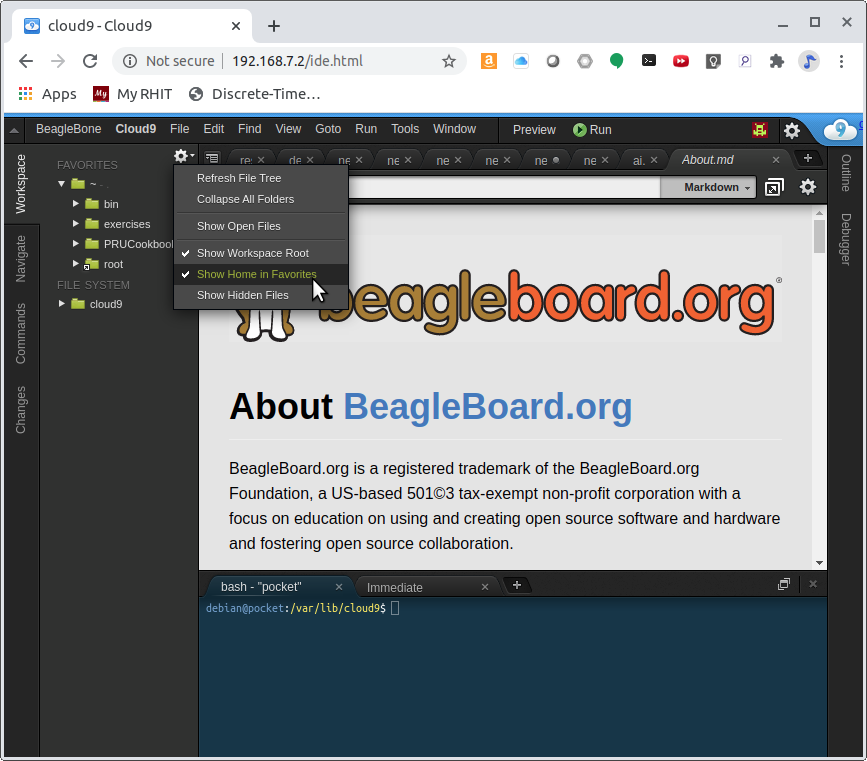

include::../header.adoc[]

== Getting Started
We assume you have some experience with the Beagle and are here to learn about 
the PRU.  This chapter discusses what Beagles are out there, how to load the 
latest software image on your beagle, how to run the Cloud9 IDE and how to 
blink an LED.

If you already have your Beagle and know your way around it, you can find the
code (and the whole book) on the PRU Cookbook github site: 
<https://github.com/MarkAYoder/PRUCookbook>. 

=== Selecting a Beagle

==== Problem
Which Beagle should you use?

==== Solution
<http://beagleboard.org/boards> lists the many Beagles from which to choose.  
Here we'll 
give examples for the venerable http://beagleboard.org/black[BeagleBone Black], 
the robotics http://beagleboard.org/blue[BeagleBone Blue], 
tiny http://beagleboard.org/pocket[PockeBeagle] and the powerful http://beagleboard.org/ai[AI].
All the examples should also run on the other Beagles too.

==== Discussion
===== BeagleBone Black
If you aren't sure which Beagle to use, it's hard to go wrong with the
http://beagleboard.org/black[BeagleBone Black].  It's the most popular member of the open hardware Beagle family.

[[start_black]]
.BeagleBone Black
image:figures/product_detail_black_sm.jpg[BeableBone Black]

The Black has:

* AM335x 1GHz ARM® Cortex-A8 processor
* 512MB DDR3 RAM
* 4GB 8-bit eMMC on-board flash storage
* 3D graphics accelerator
* NEON floating-point accelerator
* 2x PRU 32-bit microcontrollers
* USB client for power & communications
* USB host
* Ethernet
* HDMI
* 2x 46 pin headers

See <http://beagleboard.org/black> for more details.

===== BeagleBone Blue

The http://beagleboard.org/blue[Blue] is a good choice if you are doing robotics.

[[start_blue]]
.BeagleBone Blue
image::figures/beagle-blue.png[BeagleBone Blue]

The Blue has everything the Black has except it has no Ethernet or HDMI.  
But it also has:

* Wireless: 802.11bgn, Bluetooth 4.1 and BLE
* Battery support: 2-cell LiPo with balancing, LED state-of-charge monitor
* Charger input: 9-18V
* Motor control: 8 6V servo out, 4 bidirectional DC motor out, 4 quadrature encoder in
* Sensors: 9 axis IMU (accels, gyros, magnetometer), barometer, thermometer
* User interface: 11 user programmable LEDs, 2 user programmable buttons

In addition you can mount the Blue on the 
https://www.renaissancerobotics.com/eduMIP.html[EduMIP kit] as shown in
<<start_edumip>> to get a balancing robot.

[[start_edumip]]
.BeagleBone Blue EduMIP Kit
image::figures/edumip.png[BeagleBone Blue EduMIP Kit]

<https://www.hackster.io/53815/controlling-edumip-with-ni-labview-2005f8> 
shows how to assemble the robot and control it from 
http://www.ni.com/en-us/shop/labview.html[LabVIEW].

===== PocketBeagle
The http://beagleboard.org/pocket[PocketBeagle] is the smallest member of the 
Beagle family.  It is an ultra-tiny-yet-complete Beagle that is software 
compatible with the other Beagles.

[[start_pocket]]
.PocketBeagle
image::figures/PocketBeagle-size-compare-small.jpg[PocketBeagle]

The Pocket is based on the same processor as the Black and Blue and has:

* 8 analog inputs
* 44 digital I/Os and 
* numerous digital interface peripherals

See <http://beagleboard.org/pocket> for more details.

===== BeagleBone AI
If you want to do deep learning, try the  http://beagleboard.org/ai[BeagleBone AI].

[[start_ai]]
.BeagleBone AI
image:figures/BB_AI_BeautyAngle_800px.jpg[BeableBone AI]

The AI has:

* Dual Arm® Cortex®-A15 microprocessor subsystem
* 2 C66x floating-point VLIW DSPs
* 2.5MB of on-chip L3 RAM
* 2x dual Arm® Cortex®-M4 co-processors
* 4x Embedded Vision Engines (EVEs)
* 2x dual-core Programmable Real-Time Unit and Industrial Communication SubSystem (PRU-ICSS)
* 2D-graphics accelerator (BB2D) subsystem
* Dual-core PowerVR® SGX544™ 3D GPU
* IVA-HD subsystem (4K @ 15fps encode and decode support for H.264, 1080p60 for others)
* BeagleBone Black mechanical and header compatibility
* 1GB RAM and 16GB on-board eMMC flash with high-speed interface
* USB type-C for power and superspeed dual-role controller; and USB type-A host
* Gigabit Ethernet, 2.4/5GHz WiFi, and Bluetooth
* microHDMI
* Zero-download out-of-box software experience with Debian GNU/Linux

=== Installing the Latest OS on Your Bone

==== Problem
You want to find the lastest version of Debian that is available for your Bone.

==== Solution
On your host computer open a browser and go to
http://beagleboard.org/latest-images.

// TODO  Update links

This shows you two current choices of recent Debian images,
one for the BeagleBone AI 
(https://debian.beagleboard.org/images/am57xx-debian-10.3-iot-tidl-armhf-2020-04-06-6gb.img.xz[AM5729 Debian 10.3 2020-04-06 8GB SD IoT TIDL]) and
one for all the other Beagles (
https://debian.beagleboard.org/images/bone-debian-10.3-iot-armhf-2020-04-06-4gb.img.xz[AM3358 Debian 10.3 2020-04-06 4GB SD IoT]).
Download the one for your Beagle.

.Latest Debian images
image:figures/latest-images.png[Latest Debian images]

It contains all the packages we'll need.

=== Flashing a Micro SD Card
==== Problem
I've downloaded the image and need to flash my micro SD card.

==== Solution
Get a micro SD card that has at least 4GB and preferibly 8GB.  

There are many ways to flash the card, but the best seems to be Etcher by
https://www.balena.io/.  Go to <https://www.balena.io/etcher/> and download the version for your host 
computer.  Fire up Etcher, select the image you just downloaded (no need to 
uncompress it, Etcher does it for you), select the SD card and hit the *Flash* 
button and wait for it to finish.

[[start_etcher]]
.Etcher
image::figures/etcher.png[Ether]

Once the SD is flashed, insert it in the Beagle and power it up.

=== Cloud9 IDE
==== Problem
How do I manage and edit my files?

==== Solution
The image you downloaded includes https://aws.amazon.com/cloud9/[Cloud9],
a web-based intergrated development environment (IDE) as shown in 
<<start_c9>>.

[[start_c9]]
.Cloud9 IDE
image:figures/c9.png[The Cloud9 IDE]

Just point the browswer on your host computer to <http://192.168.7.2> 
and start exploring.  If you want the files in your home directory to appear
in the tree structure click the settings gear and select *Show Home in Favorites* 
as shown in <<start_c9_show_home>>.

[[start_c9_show_home]]
.Cloud9 Showing Home files

If you want to edit files beyond your home directory you can link to the root file
system by:
[source] 
[subs=+quotes]
----
bone$ *cd*
bone$ *ln -s / root*
bone$ *cd root*
bone$ *ls*
bbb-uEnv.txt  boot  etc   ID.txt  lost+found  mnt           opt   root  sbin  sys  usr
bin           dev   home  lib     media       nfs-uEnv.txt  proc  run   srv   tmp  var
----
Now you can reach all the files from Cloud9.

=== Getting Example Code
==== Problem
You are ready to start playing with the examples and need to find the code.

==== Solution
You can find the code (and the whole book) on the PRU Cookbook github site: 
<https://github.com/MarkAYoder/PRUCookbook/tree/master/docs>.  Just clone 
it on your Beagle and then look in the *docs* directory.  

[source,linenums]
[subs=+quotes]
----
bone$ *git clone https://github.com/MarkAYoder/PRUCookbook.git*
bone$ *cd PRUCookbook/docs/*
bone$ *ls -F*
01case/     05blocks/  book.html       header.adoc  notes.adoc
02start/    06io/      book.pdf        index.adoc   notes.html
03details/  07more/    copyright.adoc  index.html   style.adoc
04debug/    book.adoc  hack.sh*        Makefile     style.html
----

Each chapter has its own
directory and within that directory is a *code* directory that has all of the 
code.

[source,linenums]
[subs=+quotes]
----
bone$ *cd 02start/code/*
bone$ *ls*
hello.pru0.c  hello.pru1_1.c  Makefile  setup.sh
----

Go and explore.

=== Blinking an LED
==== Problem
You want to make sure everything is set up by blinking an LED.

==== Solution
The 'hello, world' of the embedded world is to flash an LED. <<start_hello>> 
is some code that blinks the `USR3` LED ten times using the PRU.

// TODO The *'s and _'s in the code are messing with the formatting.

[[start_hello]]
.hello.pru0.c
[source,c,linenums]
[subs=+quotes]
----
include::code/hello.pru0.c[]
----

Later chapters will go into details of how this code works, but if you want 
to run it right now do the following.

[source]
[subs=+quotes]
----
bone$ *git clone https://github.com/MarkAYoder/PRUCookbook.git*
bone$ *cd PRUCookbook/docs/02start/code*
----

[[start_running_code]]
.Running Code on the Black or Pocket
[source]
[subs=+quotes]
----
bone$ *make TARGET=hello.pru0*
/var/lib/cloud9/common/Makefile:28: MODEL=TI_AM335x_BeagleBone_Black,TARGET=hello.pru0,COMMON=/var/lib/cloud9/common
/var/lib/cloud9/common/Makefile:147: GEN_DIR=/tmp/cloud9-examples,CHIP=am335x,PROC=pru,PRUN=0,PRU_DIR=/sys/class/remoteproc/remoteproc1,EXE=.out
-    Stopping PRU 0
-	copying firmware file /tmp/cloud9-examples/hello.pru0.out to /lib/firmware/am335x-pru0-fw
write_init_pins.sh
writing "none" to "/sys/class/leds/beaglebone:green:usr3/trigger"
-    Starting PRU 0
MODEL   = TI_AM335x_BeagleBone_Black
PROC    = pru
PRUN    = 0
PRU_DIR = /sys/class/remoteproc/remoteproc1
----

.Running Code on the AI
[source]
[subs=+quotes]
----
bone$ *make TARGET=hello.pru1_1*
/var/lib/cloud9/common/Makefile:28: MODEL=BeagleBoard.org_BeagleBone_AI,TARGET=hello.pru1_1
-    Stopping PRU 1_1
CC	hello.pru1_1.c
"/var/lib/cloud9/common/prugpio.h", line 4: warning #1181-D: #warning directive: "Found AI"
LD	/tmp/cloud9-examples/hello.pru1_1.o
-	copying firmware file /tmp/cloud9-examples/hello.pru1_1.out to /lib/firmware/am57xx-pru1_1-fw
write_init_pins.sh
writing "none" to "/sys/class/leds/beaglebone:green:usr3/trigger"
-    Starting PRU 1_1
MODEL   = BeagleBoard.org_BeagleBone_AI
PROC    = pru
PRUN    = 1_1
PRU_DIR = /dev/remoteproc/pruss1-core1
rm /tmp/cloud9-examples/hello.pru1_1.o
----

Look quickly and you will see the `USR3` LED blinking.  

Later sections give more details on how all this works.
