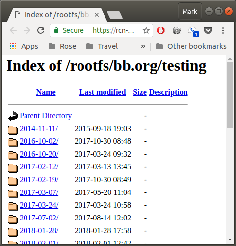
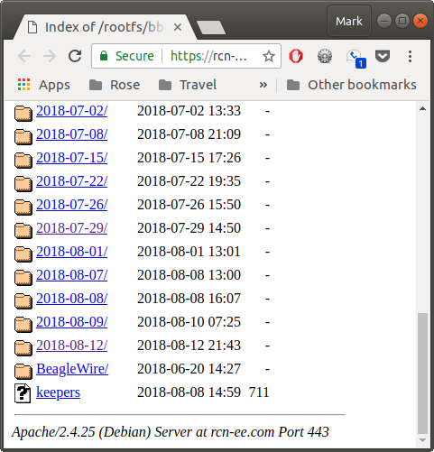
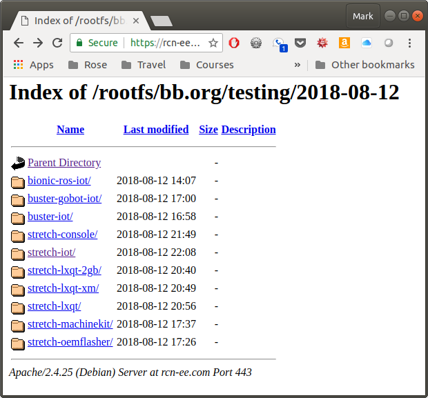
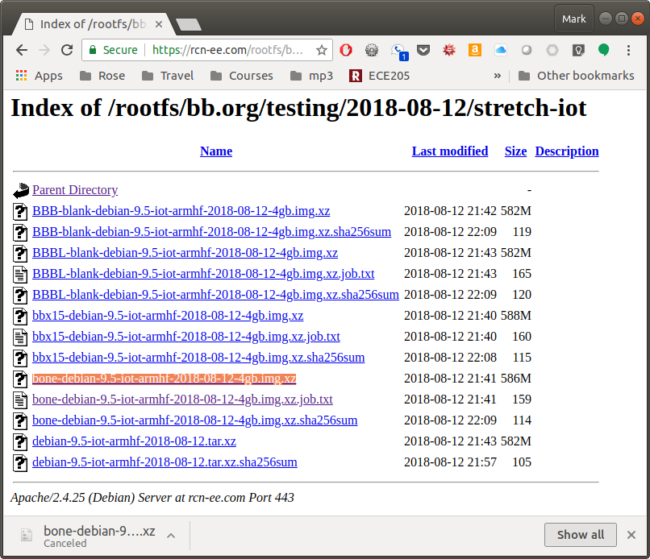

include::../header.adoc[]

== Getting Started
We assume you have some experience with the Beagle and are here to learn about 
the PRU.  This chapter discusses what Beagles are out there, how to load the 
latest software image on your beagle, how to run the Cloud9 IDE and how to 
blink an LED.

If you already have your Beagle and know your way around it, you can find the
code (and the whole book) on the PRU Cookbook github site: 
<https://github.com/MarkAYoder/PRUCookbook>. 

=== Selecting a Beagle

==== Problem
Which Beagle should you use?

==== Solution
<http://beagleboard.org/boards> lists the many Beagles from which to choose.  
Here we'll 
give examples for the venerable http://beagleboard.org/black[BeagleBone Black], 
the robotics http://beagleboard.org/blue[BeagleBone Blue] and 
tiny http://beagleboard.org/pocket[PockeBeagle].  All the examples should also 
run on the other Beagles too.

==== Discussion
===== BeagleBone Black
If you aren't sure which Beagle to use, it's hard to go wrong with the
http://beagleboard.org/black[BeagleBone Black].  It's the most popular member of the open hardware Beagle family.

[[start_black]]
.BeagleBone Black
image:figures/product_detail_black_sm.jpg[BeableBone Black]
// TODO:  Remove magnifying glass.

The Black has:

* AM335x 1GHz ARM® Cortex-A8 processor
* 512MB DDR3 RAM
* 4GB 8-bit eMMC on-board flash storage
* 3D graphics accelerator
* NEON floating-point accelerator
* 2x PRU 32-bit microcontrollers
* USB client for power & communications
* USB host
* Ethernet
* HDMI
* 2x 46 pin headers

See <http://beagleboard.org/black> for more details.

===== BeagleBone Blue

The http://beagleboard.org/blue[Blue] is a good choice if you are doing robotics.

[[start_blue]]
.BeagleBone Blue
image::figures/beagle-blue.png[BeagleBone Blue]

The Blue has everything the Black has except it has no Ethernet or HDMI.  
But it also has:

* Wireless: 802.11bgn, Bluetooth 4.1 and BLE
* Battery support: 2-cell LiPo with balancing, LED state-of-charge monitor
* Charger input: 9-18V
* Motor control: 8 6V servo out, 4 bidirectional DC motor out, 4 quadrature encoder in
* Sensors: 9 axis IMU (accels, gyros, magnetometer), barometer, thermometer
* User interface: 11 user programmable LEDs, 2 user programmable buttons

In addition you can mount the Blue on the 
https://www.renaissancerobotics.com/eduMIP.html[EduMIP kit] as shown in
<<start_edumip>> to get a balancing robot.

[[start_edumip]]
.BeagleBone Blue EduMIP Kit
image::figures/edumip.png[BeagleBone Blue EduMIP Kit]

<https://www.hackster.io/53815/controlling-edumip-with-ni-labview-2005f8> 
shows how to assemble the robot and control it from 
http://www.ni.com/en-us/shop/labview.html[LabVIEW].

===== PocketBeagle
The http://beagleboard.org/pocket[PocketBeagle] is the newest member of the 
Beagle family.  It is an ultra-tiny-yet-complete Beagle that is software 
compatible with the other Beagles.

[[start_pocket]]
.PocketBeagle
image::figures/PocketBeagle-size-compare-small.jpg[PocketBeagle]

The Pocket is based on the same processor as the Black and Blue and has:

* 8 analog inputs
* 44 digital I/Os and 
* numerous digital interface peripherals

See <http://beagleboard.org/pocket> for more details.

=== Installing the Latest OS on Your Bone

==== Problem
You want to find the lastest version of Debian that is available for your Bone.

==== Solution
On your host computer open a browser and go to
http://rcn-ee.net/deb/testing.
This shows you a list of the dates of the most recent Debian images.

.Latest Debian images

Scroll to the bottom of the list for the most recent image as shown in
<<start_images>>.

[[start_images]]
.Latest Debian images bottom view

Click on the most recent one and you'll see many choices as shown in 
<<start_choices>>.

[[start_choices]]
.Debian Images from which to choose

I suggest using the *stretch-iot* image.  *buster* is still a few months 
from release at the time of this writing and isn't ready yet.  
The other *stretech* images include 
x-window packages which we don't need.  The *stretch-console* is a minimal 
image which doesn't include things we _do_ need.

Click on *stretch-iot* and you'll see <<start_strtech>>.

[[start_strtech]]
.stretch-iot choices

Download *bone-debian-9.5-iot-armhf-2018-08-12-4gb.img.xz*.  It contains all the 
packages we'll need.

=== Flashing a Micro SD Card
==== Problem
I've downloaded the image and need to flash my micro SD card.

==== Solution
Get a micro SD card that has at least 4GB and preferibly 8GB.  

There are many ways to flash the card, but the best seems to be Etcher by
_resin.io_.  Go to <https://etcher.io/> and download the version for your host 
computer.  Fire up Etcher, select the image you just downloaded (no need to 
uncompress it, Etcher does it for you), select the SD card and hit the *Flash* 
button and wait for it to finish.

[[start_etcher]]
.Etcher
image::figures/etcher.png[Ether]

Once the SD is flashed, insert it in the Beagle and power it up.

=== Cloud9 IDE
==== Problem
How do I manage and edit my files?

==== Solution
The image you downloaded includes https://aws.amazon.com/cloud9/[Cloud9],
a web-based intergrated development environment (IDE) as shown in 
<<start_c9>>.

[[start_c9]]
.Cloud9 IDE
image:figures/c9.png[The Cloud9 IDE]

Just point the browswer on your host computer to <http://192.168.7.2:3000> 
and start exploring.

=== Getting Example Code
==== Problem
You are ready to start playing with the examples and need to find the code.

==== Solution
You can find the code (and the whole book) on the PRU Cookbook github site: 
<https://github.com/MarkAYoder/PRUCookbook/tree/master/docs>.  Just clone 
it on your Beagle and then look in the *docs* directory.  

[source,bash,linenums]
[subs=+quotes]
----
bone$ *git clone https://github.com/MarkAYoder/PRUCookbook.git*
bone$ *cd PRUCookbook/docs/*
bone$ *ls -F*
01case/     05blocks/  book.html       header.adoc  notes.adoc
02start/    06io/      book.pdf        index.adoc   notes.html
03details/  07more/    copyright.adoc  index.html   style.adoc
04debug/    book.adoc  hack.sh*        Makefile     style.html
----

Each chapter has its own
directory and within that directory is a *code* directory that has all of the 
code.

[source,bash,linenums]
[subs=+quotes]
----
bone$ *cd 02start/code/*
bone$ *ls*
AM335x_PRU.cmd  hello.c  Makefile  resource_table_empty.h  setup.sh
----

Go and explore.

=== Blinking an LED
==== Problem
You want to make sure everything is set up by blinking an LED.

==== Solution
The 'hello, world' of the embedded world is to flash an LED. <<start_hello>> 
is some code that blinks the `USR3` LED five times using the PRU.

// TODO The *'s and _'s in the code are messing with the formatting.

[[start_hello]]
.hello.c
[source,c,linenums]
[subs=+quotes]
----
include::code/hello.c[]
----

Later chapters will go into details of how this code works, but if you want 
to run it right now do the following.

[[start_running_code]]
.Running Code
[source,bash]
[subs=+quotes]
----
bone$ *git clone https://github.com/MarkAYoder/PRUCookbook.git*
bone$ *cd PRUCookbook/docs/02start/code*
bone$ *source setup.sh*
PRUN=0
TARGET=hello
bone$ *make*
-    Stopping PRU 0
[sudo] password for debian: 
stop
CC	hello.c
LD	/tmp/pru0-gen/hello.obj
-	copying firmware file /tmp/pru0-gen/hello.out to /lib/firmware/am335x-pru0-fw
-    Starting PRU 0
start
----

Look quickly and you will see the `USR3` LED blinking.  

Later sections give more details on how all this works.
