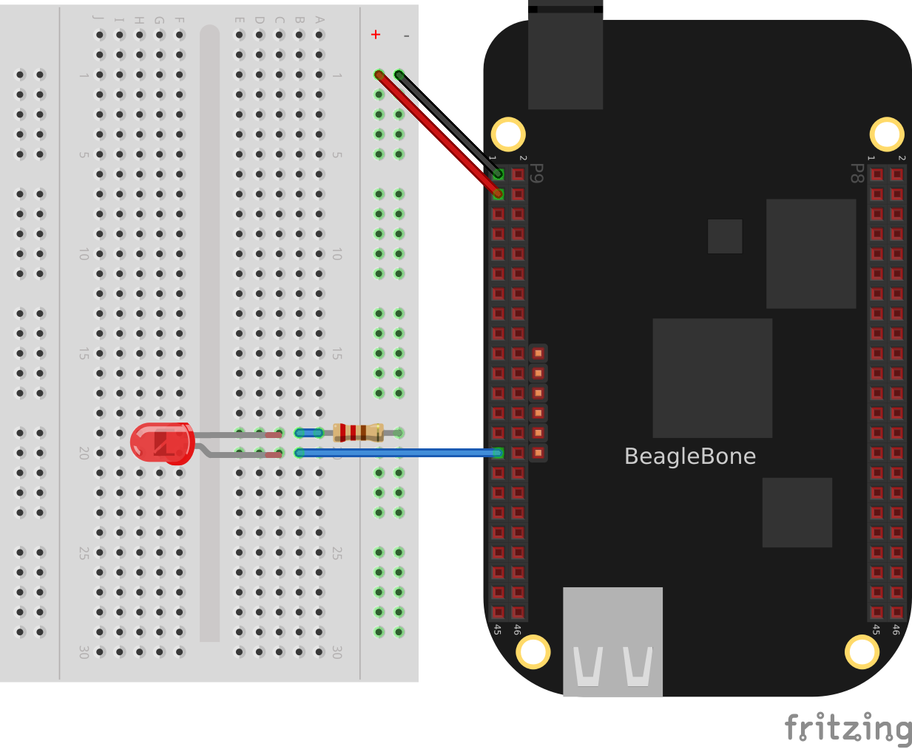
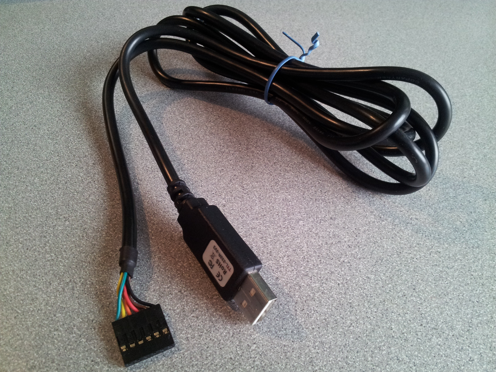
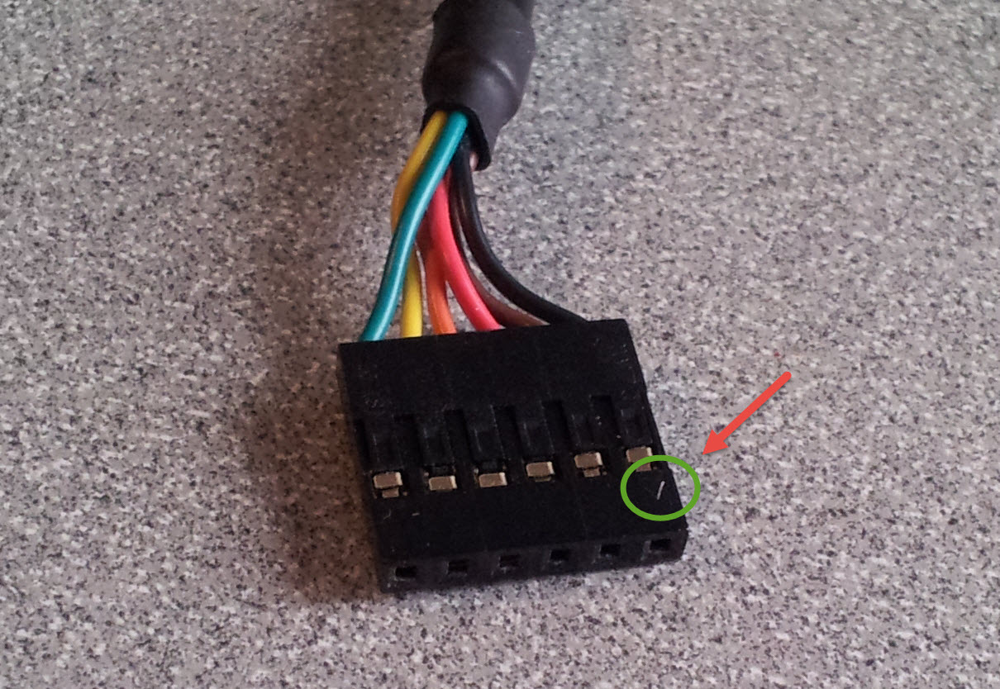
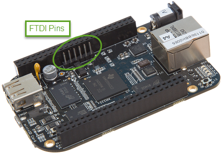
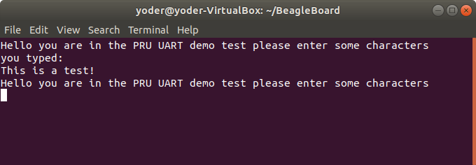

include::../header.adoc[]

include::../copyright.adoc[copyright]

== Debugging and Benchmarking

One of the challenges is getting debug
information out of the PRUs since they don't have a traditional `printf()`.
In this chapter four different methods are presented that I've found useful in 
debugging.  The first is simply attaching an LED.  The second is using 
`dmesg` to watch the kernel messages.  `prudebug`, a simple debugger that 
allows you to inspect registers and memory of the PRUs, is then presented. 
Finally, using one of the UARTS to send debugging information out a serial port 
is shown. 

=== Debugging via an LED
==== Problem
I need a simple way to see if my program is running without slowing the 
real-time execution.

==== Solution
One of the
simplest ways to do this is to attach an LED to the output pin and watch it 
flash.  
<<debug_LED>> shows an LED attached to pin P9_29 of the BeagleBone Black.

[[debug_LED]]
.LED used for debugging P9_29

Make sure you have the LED in the correct way, or it won't work.

==== Discussion

If your output is changing more than a few times a second, the LED will be 
blinking too fast and you'll need an oscilloscope or a logic analyzer to
see what's happening.

Another useful tool that let's you see the contents of the registers and 
RAM is discussed in <<debug_prudebug>>.

=== dmesg –Hw

==== Problem
I'm getting an error message (`/sys/devices/platform/ocp/4a326000.pruss-soc-bus/4a300000.pruss/4a334000.pru0/remoteproc/remoteproc1/state: Invalid argument`)
when I load my code, but don't know what's causing it.

==== Solution
The command `dmesg` outputs useful information when dealing with the kernel.
Simplying running `dmesg -H` can tell you a lot.  The `-H` flag puts the
dates in the human readable form.  Often I'll have a window open running `dmesg -Hw`;
the `-w` tells it to wait for more information.

Here's what `dmesg` said for the example above.

.dmesg -Hw
[source,linenums] 
----
[  +0.000018] remoteproc remoteproc1: header-less resource table
[  +0.011879] remoteproc remoteproc1: Failed to find resource table
[  +0.008770] remoteproc remoteproc1: Boot failed: -22
----
It quickly told me I needed to add the line `#include "resource_table_empty.h"`
to my code.

[[debug_prudebug]]
=== prudebug - A Simple Debugger for the PRU
==== Problem
You need to examine registers and memory on the PRUs.

==== Solution
`prudebug` is a simple debugger for the PRUs that lets you start and stop the PRUs and
examine the registers and memory. It can be found on GitHub 
<https://github.com/RRvW/prudebug-rl>.  I have a version I updated to use byte
addressing rather than word addressing.  This makes it easier to work with the
assembler output. You can find it in my GitHub BeagleBoard repo 
<https://github.com/MarkAYoder/BeagleBoard-exercises/tree/master/pru/prudebug>.

Just download the files and type `make`.

==== Discussion
Once `prudebug` is installed is rather easy to use.

[source]
[subs=+quotes]
----
bone$ *sudo prudebug*
PRU Debugger v0.25
(C) Copyright 2011, 2013 by Arctica Technologies.  All rights reserved.
Written by Steven Anderson

Using /dev/mem device.
Processor type		AM335x
PRUSS memory address	0x4a300000
PRUSS memory length	0x00080000

         offsets below are in 32-bit byte addresses (not ARM byte addresses)
         PRU            Instruction    Data         Ctrl
         0              0x00034000     0x00000000   0x00022000
         1              0x00038000     0x00002000   0x00024000
----
You get help by entering `help`.  You cal also enter `hb` to get a brief help.
[source.bash]
[subs=+quotes]

----
PRU0> *hb*
Command help

    BR [breakpoint_number [address]] - View or set an instruction breakpoint
    D memory_location_ba [length] - Raw dump of PRU data memory (32-bit byte offset from beginning of full PRU memory block - all PRUs)
    DD memory_location_ba [length] - Dump data memory (32-bit byte offset from beginning of PRU data memory)
    DI memory_location_ba [length] - Dump instruction memory (32-bit byte offset from beginning of PRU instruction memory)
    DIS memory_location_ba [length] - Disassemble instruction memory (32-bit byte offset from beginning of PRU instruction memory)
    G - Start processor execution of instructions (at current IP)
    GSS - Start processor execution using automatic single stepping - this allows running a program with breakpoints
    HALT - Halt the processor
    L memory_location_iwa file_name - Load program file into instruction memory
    PRU pru_number - Set the active PRU where pru_number ranges from 0 to 1
    Q - Quit the debugger and return to shell prompt.
    R - Display the current PRU registers.
    RESET - Reset the current PRU
    SS - Single step the current instruction.
    WA [watch_num [address [value]]] - Clear or set a watch point
    WR memory_location_ba value1 [value2 [value3 ...]] - Write a 32-bit value to a raw (offset from beginning of full PRU memory block)
    WRD memory_location_ba value1 [value2 [value3 ...]] - Write a 32-bit value to PRU data memory for current PRU
    WRI memory_location_ba value1 [value2 [value3 ...]] - Write a 32-bit value to PRU instruction memory for current PRU

----
Initially you are talking to PRU 0.  You can enter `pru 1` to talk to PRU 1.
The commands I find most useful are, `r`, to see the registers.
[source]
[subs=+quotes]
----
PRU0> *r*
Register info for PRU0
    Control register: 0x00008003
      Reset PC:0x0000  RUNNING, FREE_RUN, COUNTER_DISABLED, NOT_SLEEPING, PROC_ENABLED

    Program counter: 0x0030
      Current instruction: ADD R0.b0, R0.b0, R0.b0

    Rxx registers not available since PRU is RUNNING.
----
Notice the PRU has to be stopped to see the register contents.
[source]
[subs=+quotes]
----
PRU0> *h*
PRU0 Halted.
PRU0> *r*
Register info for PRU0
    Control register: 0x00000001
      Reset PC:0x0000  STOPPED, FREE_RUN, COUNTER_DISABLED, NOT_SLEEPING, PROC_DISABLED

    Program counter: 0x0028
      Current instruction: LBBO R15, R15, 4, 4

    R00: 0x00000000    R08: 0x00000000    R16: 0x00000001    R24: 0x00000002
    R01: 0x00000000    R09: 0xaf40dcf2    R17: 0x00000000    R25: 0x00000003
    R02: 0x000000dc    R10: 0xd8255b1b    R18: 0x00000003    R26: 0x00000003
    R03: 0x000f0000    R11: 0xc50cbefd    R19: 0x00000100    R27: 0x00000002
    R04: 0x00000000    R12: 0xb037c0d7    R20: 0x00000100    R28: 0x8ca9d976
    R05: 0x00000009    R13: 0xf48bbe23    R21: 0x441fb678    R29: 0x00000002
    R06: 0x00000000    R14: 0x00000134    R22: 0xc8cc0752    R30: 0x00000000
    R07: 0x00000009    R15: 0x00000200    R23: 0xe346fee9    R31: 0x00000000

----
You can resume using `g` which starts right where you left off, or use `reset` to
restart back at the beginning.

The `dd` command dumps the memory.  Keep in mind the following.

.Important memory locations
[cols="1,9"]
|===
|Address|Contents

|0x00000|Start of the ((stack)) for PRU 0.  The file ((AM335x_PRU.cmd)) specifies 
where the stack is.
|0x00100|Start of the ((heap)) for PRU 0.
|0x00200|Start of DRAM that your programs can use.  The ((Makefile)) specifies
the size of the ((stack)) and the ((heap)).
|0x10000|Start of the memory shared between the PRUs.
|===

Using `dd` with no address prints the next section of memory.
[source]
[subs=+quotes]
----
PRU0> *dd*
dd 
Absolute addr = 0x0000, offset = 0x0000, Len = 16
[0x0000] 0x00000000 0x00000000 0x00000000 0x00000000 
[0x0010] 0x00000000 0x00000000 0x00000000 0x00000000 
[0x0020] 0x00000000 0x00000000 0x00000000 0x00000000 
[0x0030] 0x00000000 0x00000000 0x00000000 0x00000000 
----
The stack grows from higher memory to lower memory, so you often won't see 
much around address `0x0000`.

[source]
[subs=+quotes]
----
PRU0> *dd 0x100*
dd 0x100
Absolute addr = 0x0100, offset = 0x0000, Len = 16
[0x0100] 0x00000001 0x00000002 0x00000003 0x00000004 
[0x0110] 0x00000004 0x00000003 0x00000002 0x00000001 
[0x0120] 0x00000001 0x00000000 0x00000000 0x00000000 
[0x0130] 0x00000000 0x00000200 0x862e5c18 0xfeb21aca 
----
Here we see some values on the heap.

[source]
[subs=+quotes]
----
PRU0> *dd 0x200*
dd 0x200
Absolute addr = 0x0200, offset = 0x0000, Len = 16
[0x0200] 0x00000001 0x00000004 0x00000002 0x00000003 
[0x0210] 0x00000003 0x00000011 0x00000004 0x00000010 
[0x0220] 0x0a4fe833 0xb222ebda 0xe5575236 0xc50cbefd 
[0x0230] 0xb037c0d7 0xf48bbe23 0x88c460f0 0x011550d4
----
Data written explicity to `0x0200` of the DRAM.
[source]
[subs=+quotes]
----
PRU0> *dd 0x10000*
dd 0x10000
Absolute addr = 0x10000, offset = 0x0000, Len = 16
[0x10000] 0x8ca9d976 0xebcb119e 0x3aebce31 0x68c44d8b 
[0x10010] 0xc370ba7e 0x2fea993b 0x15c67fa5 0xfbf68557 
[0x10020] 0x5ad81b4f 0x4a55071a 0x48576eb7 0x1004786b 
[0x10030] 0x2265ebc6 0xa27b32a0 0x340d34dc 0xbfa02d4b
----
Here's the shared memory.

You can also use `prudebug` to set breakpoints and single step, 
but I haven't used that feature much.

<<../05blocks/blocks.html#_memory_allocation, Memory Allocation>> gives examples 
of how you can control where your vaiables are stored in memory.

=== UART
==== Problem
I'd like to use something like `printf()` to debug my code.

==== Solution
One simple, yet effective approach to 'printing' from the PRU is
an idea taken from the Adruino playbook; 
use the UART (serial port) to output debug information.  The PRU has it's
own UART that can send characters to a serial port.

You'll need a 3.3V FTDI cable to go between your Beagle and the USB port 
on your host computer as shown in <<debug_ftdi>>.[FTDI images are from the
BeagleBone Cookbook http://shop.oreilly.com/product/0636920033899.do] 
You can get such a cable from places such as 
https://www.sparkfun.com/products/9717[Sparkfun] or 
https://www.adafruit.com/product/70[Adafruit].  

[[debug_ftdi]]
.FDTI cable

==== Discussion
The Beagle side of the FTDI cable has a small triangle on it as shown in 
<<debug_ftdi_connector>>.  

[[debug_ftdi_connector]]
.FTDI connector

The connector attaches to the Black on the FTDI pins, shown in <<debug_ftdi_pins>>,
with the triangle connecting near pin *P9_20* which is the right side of 
the connector as viewed in the figure.

[[debug_ftdi_pins]]
.FTDI pins for the FTDI connector

Two examples of using the UART are presented here.  The first 
(<<debug_uart1>>) sends
a character out the serial port then waits for a character to come in.  Once
the new character arrives another character is output.

The second example (<<debug_uart2>>) prints out a string and then 
waits for characters to arrive.
Once an ENTER appears the string is sent back.

For either of these you will need to set the pin muxes.

.config-pin
[source,linenums] 
[subs=+quotes]
----
# Configure tx
bone$ *config-pin P9_24 pru_uart*
# Configure rx
bone$ *config-pin P9_26 pru_uart*
----

// TODO:  Add code for Blue and Pocket

===== uart1.c
Set the following variables so `make` will know what to compile.

.make
[source,linenums] 
[subs=+quotes]
----
bone$ *export PRUN=0*
bone$ *export TARGET=uart1*
bone$ *make*
-    Stopping PRU 0
[sudo] password for debian: 
stop
CC	uart1.c
"uart1.c", line 87: warning #112-D: statement is unreachable
"uart1.c", line 15: warning #552-D: variable "rx" was set but never used
LD	/tmp/pru0-gen/uart1.obj
-	copying firmware file /tmp/pru0-gen/uart1.out to /lib/firmware/am335x-pru0-fw
-    Starting PRU 0
start
----
Now `make` will compile, load PRU0 and start it.  In a terminal window 
on your host computer run
[source,linenums] 
[subs=+quotes]
----
host *screen /dev/ttyUSB0 115200*
----

It will initially display the first charters (`H`) and then as you enter
characters on the keyboard, the rest of the message will appear.

.uart1.c output
image:figures/uart1.png[uart1.c output]

Here's the code (`uart1.c`) that does it.

[[debug_uart1]]
.uart1.c
[source,c,linenums]
----
include::code/uart1.c[uart1.c]
----
The first part of the code initializes the UART. Then the line `CT_UART.THR = tx;`
takes a character in `tx` and sends it to the transmit buffer on the UART.
Think of this as the UART version of the `printf()`. 

Later the line `while (!((CT_UART.FCR & 0x2) == 0x2));`
waits for the transmit FIFO to be empty.  This makes sure later characters
won't overwrite the buffer before they can be sent.  The downside is, this will
cause your code to wait on the buffer and it might miss an important 
real-time event.

The line `while ((CT_UART.LSR & 0x1) == 0x0);` waits for an input from the 
UART (possibly missing something) and `rx = CT_UART.RBR;` reads from the
receive register on the UART.

These simple lines should be enough to place in your code to print out
debugging information.

===== uart2.c
If you want to try `uart2.c`, run the following:

.make
[source,linenums]
[subs=+quotes]
----
bone$ *export PRUN=0*
bone$ *export TARGET=uart2*
bone$ *make*
-    Stopping PRU 0
stop
CC	uart2.c
"uart2.c", line 122: warning #112-D: statement is unreachable
LD	/tmp/pru0-gen/uart2.obj
-	copying firmware file /tmp/pru0-gen/uart2.out to /lib/firmware/am335x-pru0-fw
-    Starting PRU 0
start
----

You will see:

.uart2.c output

Type a few characters and hit ENTER.  The PRU will playback what you typed,
but it won't echo it as you type.

`uart2.c` defines `PrintMessageOut()` which is passed a string that is
sent to the UART. It takes advantage of the eight character FIFO on the UART.
Be careful using it because it also uses `while (!CT_UART.LSR_bit.TEMT);` to
wait for the FIFO to empty, which may cause your code to miss something.

<<debug_uart2>> is the code that does it.

[[debug_uart2]]
.uart2.c
[source,c,linenums]
----
include::code/uart2.c[uart2.c]
----

More complex examples can be built using the principles shown in these
examples.

=== Copyright
[source,c,linenums]
.copyright.c
----
include::code/copyright.c[copyright.c]
----