include::../header.adoc[]

== Building Blocks - Applications

Here are some examples that use the basic PRU building blocks.

The following are resources used in this chapter.

.Resources
* http://www.ti.com/lit/ug/spruhv7b/spruhv7b.pdf[PRU Optimizing C/C++ Compiler, v2.2, User's Guide]
* https://www.ti.com/lit/ug/spruh73p/spruh73p.pdf[AM335x Technical Reference Manual]
* http://exploringbeaglebone.com/[Exploring BeagleBone by Derek Molloy]
* https://cdn-shop.adafruit.com/datasheets/WS2812.pdf[WS2812 Data Sheet]

include::../copyright.adoc[copyright]

=== Memory Allocation

==== Problem
I want to control where my variables are stored in memory.
[WARNING]
====
Include a section on accessing DDR.
====

==== Solution
Each PRU has is own 8KB of data memory (Data Mem0 and Mem1) and 12KB of shared memory (Shared RAM) as shown in <<blocks_PRU_block_diagram>>.

[[blocks_PRU_block_diagram]]
.PRU Block Diagram
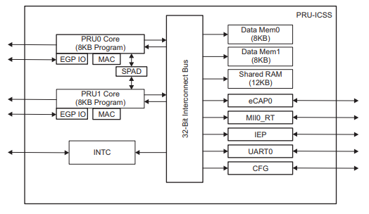

Each PRU accesses it's own DRAM starting at location 0x0000_0000. Each PRU
can also access the other PRU's DRAM starting at 0x0000_2000. Both PRUs 
access the shared RAM at 0x0001_0000. The compiler can control where each 
of these memories variables are stored.

<<blocks_shared>> shows how to allocate seven variable in six different locations.

[[blocks_shared]]
.shared.c - Examples of Using Different Memory Locations
[source,c,linenums]
[subs=+quotes]
----
include::code/shared.c[]
----

==== Discussion
Here's the line-by-line

.Line-byline for shared.c
[cols="1,9"]
|===
|Line |Explanation

|7    |`PRU_SRAM` is defined here.  It will be used later to declare variables
in the `Shared RAM` location of memory.  Section 5.5.2 on page 75 of the
http://www.ti.com/lit/ug/spruhv7b/spruhv7b.pdf[PRU Optimizing C/C++ Compiler, v2.2, User's Guide] gives details of the command.  The `PRU_SHAREDMEM` 
refers to the memory section defined in `AM335x_PRU.cmd` on line 26.  
|8,9  |These are like the previous line except for the DMEM sections.
|16   |Variables declared outside of `main()` are put on the heap.
|17   |Adding `PRU_SRAM` has the variable stored in the shared memory.
|18,19|These are stored in the PRU's local RAM.
|20,21|These lines are for storing in the `.bss` section as declared on
line 74 of `AM335x_PRU.cmd`.
|28-31|All the previous examples direct the compiler to an area in memory
and the compilers figures out what to put where.  With these lines we 
specify the exact location.  Here are start with the PRU_DRAM starting address and add 0x200 to it to avoid
the ((STACK)) and the ((HEAP)).  The advantage of this technique is you can
easily share these variables between the ARM and the two PRUs.
|36,37|Variable declared inside `main()` go on the stack.
|===

[CAUTION]
====
Using the technique of line 28-31 you can put variables anywhere, 
even where the compiler has put them.
Be careful, it's easy to overwrite what the compiler has done
====

Compile and run the program.
[source,bash,linenums]
[subs=+quotes]
----
bone$ *source shared_setup.sh*
PRUN=0
TARGET=shared
Black Found
P9_31
P9_31 Mode: pruout
P9_29
P9_29 Mode: pruout
P9_30
P9_30 Mode: pruout
P9_28
P9_28 Mode: pruout
bone$ *make*
-    Stopping PRU 0
stop
-	copying firmware file /tmp/pru0-gen/shared.out to /lib/firmware/am335x-pru0-fw
-    Starting PRU 0
start
----

Now check the ((symbol table)) to see where things are allocated.
[source,bash,linenums]
[subs=+quotes]
----
bone $ *grep shared /tmp/pru0-gen/shared.map* 
OUTPUT FILE NAME:   </tmp/pru0-gen/shared.out>
....
1     00000000  shared_2                     
1     00000118  shared_4                     
1     0000011c  shared_0                     
1     00000120  shared_5                     
1     00002000  shared_3                     
2     00010000  shared_1              
----

We see, `shared_0` had no directives and was places in the heap that is 0x100
to 0x1ff.  `shared_1` was directed to go to the SHAREDMEM, `shared_2` to 
the start of the local DRAM (which is also the top of the stack).  `shared_3`
was placed in the DRAM of PRU 1, `shared_4` was placed in the `.bss` section,
which is in the ((heap)).  Finally `shared_5` is a pointer to where the value
is stored.

Where are `shared_6` and `shared_7`?  They are declared inside `main()` and are
therefore placed on the stack at run time.  The `shared.map` file shows the
compile time allocations.  We have to look in the memory itself to see what
happen at run time.

Let's fire up `prudebug` (<<prudebug - A Simple Debugger for the PRU>>) to see
where things are.
[source,bash,linenums]
[subs=+quotes]
----
bone$ *sudo ./prudebug*
PRU Debugger v0.25
(C) Copyright 2011, 2013 by Arctica Technologies.  All rights reserved.
Written by Steven Anderson

Using /dev/mem device.
Processor type		AM335x
PRUSS memory address	0x4a300000
PRUSS memory length	0x00080000

         offsets below are in 32-bit byte addresses (not ARM byte addresses)
         PRU            Instruction    Data         Ctrl
         0              0x00034000     0x00000000   0x00022000
         1              0x00038000     0x00002000   0x00024000

PRU0> *d 0*
Absolute addr = 0x0000, offset = 0x0000, Len = 16
[0x0000] 0x0000feed 0x00000000 0x00000000 0x00000000 
[0x0010] 0x00000000 0x00000000 0x00000000 0x00000000 
[0x0020] 0x00000000 0x00000000 0x00000000 0x00000000 
[0x0030] 0x00000000 0x00000000 0x00000000 0x00000000 
----
The value of `shared_2` is in memory location 0.

[source,bash,linenums]
[subs=+quotes]
----
PRU0> *dd 0x100*
Absolute addr = 0x0100, offset = 0x0000, Len = 16
[0x0100] 0x00000000 0x00000001 0x00000000 0x00000000 
[0x0110] 0x00000000 0x00000000 0x0000beed 0x0000feef 
[0x0120] 0x00000200 0x3ec71de3 0x1a013e1a 0xbf2a01a0 
[0x0130] 0x111110b0 0x3f811111 0x55555555 0xbfc55555 
----
There are `shared_0` and `shared_3` in the heap, but where is `shared_6` and
`shared_7`?  They are supposed to be on the ((stack)) that starts at 0.

[source,bash,linenums]
[subs=+quotes]
----
PRU0> dd *0xc0*
Absolute addr = 0x00c0, offset = 0x0000, Len = 16
[0x00c0] 0x00000000 0x00000000 0x00000000 0x00000000 
[0x00d0] 0x00000000 0x00000000 0x00000000 0x00000000 
[0x00e0] 0x00000000 0x00000000 0x00000000 0x00000000 
[0x00f0] 0x00000000 0x00000000 0x00004321 0x00009876
----
There they are; the stack grows from the top. (The heap grows from the bottom.)

[source,bash,linenums]
[subs=+quotes]
----
PRU0> dd *0x2000*
Absolute addr = 0x2000, offset = 0x0000, Len = 16
[0x2000] 0x0000deed 0x00000001 0x00000000 0x557fcfb5 
[0x2010] 0xce97bd0f 0x6afb2c8f 0xc7f35df4 0x5afb6dcb 
[0x2020] 0x8dec3da3 0xe39a6756 0x642cb8b8 0xcb6952c0 
[0x2030] 0x2f22ebda 0x548d97c5 0x9241786f 0x72dfeb86 
----
And there is PRU 1's memory. And finally the shared memory.

[source,bash,linenums]
[subs=+quotes]
----
PRU0> *dd 0x10000*
Absolute addr = 0x10000, offset = 0x0000, Len = 16
[0x10000] 0xdeadbeef 0x0000feed 0x00000000 0x68c44f8b 
[0x10010] 0xc372ba7e 0x2ffa993b 0x11c66da5 0xfbf6c5d7 
[0x10020] 0x5ada3fcf 0x4a5d0712 0x48576fb7 0x1004796b 
[0x10030] 0x2267ebc6 0xa2793aa1 0x100d34dc 0x9ca06d4a  
----

The compiler offers great control over where variables are stored. Just
be sure if you are hand picking where thing are put not to put them where
the compiler is putting things.

=== Auto Initialization of Built in LED Triggers
==== Problem
I see the built in LEDs blink to their own patterns.  How do I turn this off? 
Can this be automated?

==== Solution
Each built in LED has a default action (trigger) when the Bone boots up. 
This is controlled by `/sys/class/leds`.
[subs=+quotes]
----
bone$ *cd /sys/class/leds*
bone$ *ls*
beaglebone:green:usr0  beaglebone:green:usr2
beaglebone:green:usr1  beaglebone:green:usr3
----
Here you see a directory for each of the LEDs.  Let's pick USR1.
[subs=+quotes]
----
bone$ *cd beaglebone\:green\:usr1*
bone$ *ls*
brightness  device  max_brightness  power  subsystem  trigger  uevent
bone$ *cat trigger*
none rc-feedback kbd-scrolllock kbd-numlock kbd-capslock kbd-kanalock 
kbd-shiftlock kbd-altgrlock kbd-ctrllock kbd-altlock kbd-shiftllock 
kbd-shiftrlock kbd-ctrlllock kbd-ctrlrlock usb-gadget usb-host 
*[mmc0]* mmc1 timer oneshot disk-activity ide-disk mtd nand-disk 
heartbeat backlight gpio cpu0 default-on 
----
Notice `[mmc0]` is in brackets.  This means it's the current trigger; it flashes 
when the built in flash memory is in use.  You can turn this off using:
[subs=+quotes]
----
bone$ *echo none | sudo tee trigger*
bone$ *cat trigger*
[none] rc-feedback kbd-scrolllock kbd-numlock kbd-capslock kbd-kanalock 
kbd-shiftlock kbd-altgrlock kbd-ctrllock kbd-altlock kbd-shiftllock 
kbd-shiftrlock kbd-ctrlllock kbd-ctrlrlock usb-gadget usb-host 
mmc0 mmc1 timer oneshot disk-activity ide-disk mtd nand-disk 
heartbeat backlight gpio cpu0 default-on 
----
Now it is no longer flashing.
[TIP]
====
You have to have root permissions to write to `trigger`.  Here we use 
`| sudo tee trigger` since `sudo echo none > trigger` doesn't do what you want.
====

How can this be automated so when code is run that needs the trigger off, it's 
turned off automatically?  Here's a trick.  Include the following in your code.

[source,c,linenums]
[subs=+quotes]
----
#pragma DATA_SECTION(init_pins, ".init_pins")
#pragma RETAIN(init_pins)
const char init_pins[] =  
        "/sys/class/leds/beaglebone:green:usr3/trigger\0none\0" \
        "\0\0";
----
Lines 3 and 4 declare the array `init_pins` to have an entry which is the path 
to `trigger` and the value that should be 'echoed' into it. Both are NULL
terminated.  Line 1 says to put this in a section called `.init_pins` and 
line 2 says to `RETAIN` it.  That is don't throw it away if it appears to be 
unused.

==== Discussion
The above code stores this array in the `.out` file that created, but that's not 
enough. You need to run <<blocks_write_init_pins>> on the `.out` file to make 
the code work.
[[blocks_write_init_pins]]
.write_init_pins.sh
[source,bash,linenums]
[subs=+quotes]
----
include::code/write_init_pins.sh[]
----

The `readelf` command extracts the path and value from the `.out` file.

[source,bash,linenums]
[subs=+quotes]
----
bone$ *readelf -x .init_pins /tmp/pru0-gen/shared.out* 

Hex dump of section '.init_pins':
  0x000000c0 2f737973 2f636c61 73732f6c 6564732f /sys/class/leds/
  0x000000d0 62656167 6c65626f 6e653a67 7265656e beaglebone:green
  0x000000e0 3a757372 332f7472 69676765 72006e6f :usr3/trigger.no
  0x000000f0 6e650000 0000                       ne....
----
The rest of the command formats it.  Finally line 6 echos the `none` into 
the path.

This can be generalized to initialize other things.  The point is, the `.out` 
file contains everything needed to run the executable.

[[blocks_pwm]]
=== PWM Generator
One of the simplest things a PRU can to is generate a simple
signals starting with a single channel PWM that has a fixed frequency and
duty cycle and ending with a multi channel PWM that the ARM can change
the frequency and duty cycle on the fly.  

==== Problem
I want to generate a PWM signal that has a fixed frequency and duty cycle.

==== Solution
The solution is fairly easy, but be sure to check the *Discussion* section
for details on making it work.

Here's the code.

.pwm1.c
[source,c,linenums] 
----
include::code/pwm1.c[]
----

To run this code you need to configure the pin muxes to output the PRU.  If you are on the Black run
[source,bash] 
[subs=+quotes]
----
bone$ *config-pin P9_31 pruout*
----
On the Pocket run
[source,bash] 
[subs=+quotes]
----
bone$ *config-pin P1_36 pruout*
----
Then, tell Makefile which PRU you are compiling for and what your target file is
[source,bash]
[subs=+quotes]
----
bone$ *export PRUN=0*
bone$ *export TARGET=pwm1*
----

Now you are ready to compile
[source,bash,linenums] 
[subs=+quotes]
----
bone$ *make*
-    Stopping PRU 0
stop
CC	pwm1.c
LD	/tmp/pru0-gen/pwm1.obj
-	copying firmware file /tmp/pru0-gen/pwm1.out to /lib/firmware/am335x-pru0-fw
-    Starting PRU 0
start
----
Now attach an LED (or oscilloscope) to `P9_31` on the Black or `P1.36` on the Pocket.  You should see a squarewave.

==== Discussion
Since this is our first example we'll discuss the many parts in detail.

===== pwm1.c
Here's a line-by-line expanation of the c code.

.Line-by-line of pwm1.c
[cols="1,9"]
|===
|Line|Explanation

|1   |Standard c-header include
|2   |Include for the PRU.  The compiler know where to find this since the Makefile says to look for includes in `/usr/lib/ti/pru-software-support-package`
|3   |The file `resource_table_empty.h` is used by the PRU loader.  Generally we'll use the same file, and don't need to modify it.
|===

Here's what's in `resource_table_empty.h`
.resource_table_empty.c
[source,c,linenums] 
----
include::code/resource_table_empty.h[]
----

.Line-by-line (continuted)
[cols="1,9"]
|===
|Line|Explanation

|5-6 |`__R30` and `__R31` are two variables that refer to the PRU output (`__R30`) and input (`__R31`) registers. 
When you write something to `__R30` it will show up on the corresponding output pins.  
When you read from `__R31` you read the data on the input pins.  
NOTE: Both names begin with two underscore's. Section 5.7.2 of the 
http://www.ti.com/lit/ug/spruhv7b/spruhv7b.pdf[PRU Optimizing C/C++ Compiler, v2.2, User's Guide]
gives more details.
|13    |`CT_CFG.SYSCFG_bit.STANDBY_INIT` is set to `0` to enable the OCP master port. More details on this and thousands of other regesters see the 
https://www.ti.com/lit/ug/spruh73p/spruh73p.pdf[AM335x Technical Reference Manual]. Section 4 is on the PRU and section 4.5 gives details for all the registers.
|15    |This line selects which GPIO pin to toggle.  The table below shows which bits in `__R30` map to which pins
|===

Bit 0 is the LSB.

(((mapping, positions, pin)))

[[blocks_mapping_bits]]
.Mapping bit positions to pin names
|===
|PRU|Bit|Black pin|Blue pin|Pocket pin

|0  |0  |P9_31    |        |P1.36     
|0  |1  |P9_29    |        |P1.33     
|0  |2  |P9_30    |        |P2.32     
|0  |3  |P9_28    |        |P2.30     
|0  |4  |P9_92    |        |P1.31     
|0  |5  |P9_27    |        |P2.34     
|0  |6  |P9_91    |        |P2.28     
|0  |7  |P9_25    |        |P1.29     
|0  |14 |P8_12    |        |P2.24     
|0  |15 |P8_11    |        |P2.33     
|---|---|---------|--------|----------
|1  |0  |P8_45    |        |          
|1  |1  |P8_46    |        |          
|1  |2  |P8_43    |        |          
|1  |3  |P8_44    |        |          
|1  |4  |P8_41    |        |          
|1  |5  |P8_42    |        |          
|1  |6  |P8_39    |        |          
|1  |7  |P8_40    |        |          
|1  |8  |P8_27    |        |P2.35     
|1  |9  |P8_29    |        |P2.01     
|1  |10 |P8_28    |        |P1.35     
|1  |11 |P8_30    |        |P1.04     
|1  |12 |P8_21    |        |          
|1  |13 |P8_20    |        |          
|1  |14 |         |        |P1.32     
|1  |15 |         |        |P1.30     
|===

Since we are running on PRU 0 we're using `0x0001`, that is bit 0, we'll be toggling `P9_31`.

.Line-by-line (continued again)
[cols="1,9"]
|===
|Line|Explanation

|18  |Here is where the action is.  This line reads `__R30` and then ORs it with `gpio`, setting the bits where there is a 1 in `gpio` and leaving the bits where there is a 0.  Thus we are setting the bit we selected. Finally the new value is written back to `__R30`. 
|19  |`__delay_cycles` is an instrinsic function that delays with number of cycles passed to it. Each cycle is 5ns, and we are delaying 100,000,000 cycles which is 500,000,000ns, or 0.5 seconds. 
|20  |This is like line 18, but `~gpio` inverts all the bits in `gpio` so that where we had a 1, there is now a 0.  This 0 is then ANDed with `__R30` setting the corresponding bit to 0.  Thus we are clearing the bit we selected.
|===

[TIP]
====
You can read more about instrinsics in section 5.11 of the (http://www.ti.com/lit/ug/spruhv7b/spruhv7b.pdf[PRU Optimizing C/C++ Compiler, v2.2, User's Guide].)
====

When you run this code and look at the output you will see something like the following figure.

.Output of pwm1.c with 100,000,000 delays cycles giving a 1s period
image:figures/pwm1.png[pwm1.c output]

Notice the on time (`+Width(1)`) is 500ms, just as we predicted.  The off time is 498ms, which is only 2ms off from our prediction.  The standard deviation is 0, or only 380as, which is 380 * 10^-18^!.

You can see how fast the PRU can run by setting both of the `__delay_cycles` to 0. This results in the next figure.

.Output of pwm1.c with 0 delay cycles
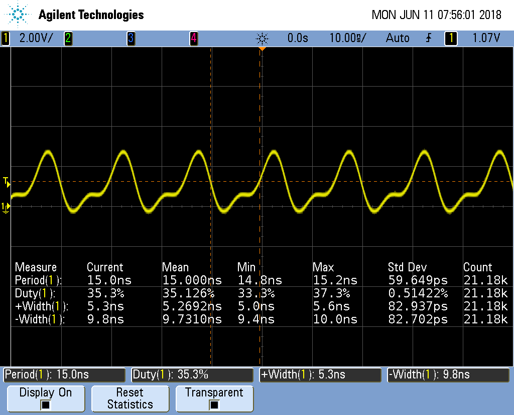

Notice the period is 15ns which gives us a frequency of about 67MHz. At this high frequency the breadboard that I'm using distorts the waveform so it's no longer a squarewave. The _on_ time is 5.3ns and the _off_ time is 9.8ns.  That means `__R30 |= gpio;` took only one 5ns cycle and `__R30 &= ~gpio;` also only took one cycle, but there is also an extra cycle needed for the loop.  This means the compiler was able to implement the while loop in just three 5ns instructions!  Not bad.

We want a square wave, so we need to add a delay to correct for the delay of looping back.

Here's the code that does just that.

.pwm2.c
[source,c,linenums] 
----
include::code/pwm2.c[]
----

The output now looks like:
.Output of pwm2.c corrected delay (`pwm3.png`)
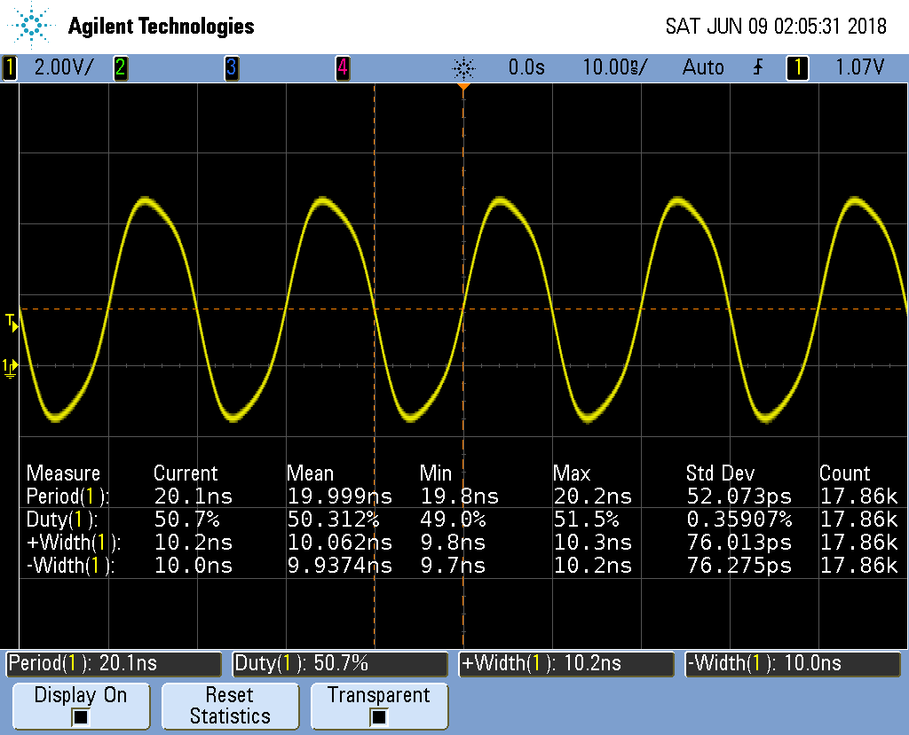

It's not hard to adjust the two `__delay_cycles` to get the desired frequency and duty cycle.

### Controlling the PWM Frequency
#### Problem
You would like to control the frequency and duty cycle of the PWM without recompiling.

#### Solution
Have the PRU read the _on_ and _off_ times from a shared memory location.  Each PRU has is own 8KB of data memory (DRAM) and 12KB of shared memory (SHAREDMEM) that the ARM processor can also access.  See <<blocks_PRU_block_diagram>>.

The DRAM 0 address is 0x0000 for PRU 0.  The same DRAM appears at address 0x4A300000 as seen from the ARM processor.
[TIP]
====
See page
184 of the https://www.ti.com/lit/ug/spruh73p/spruh73p.pdf[AM335x Technical Reference Manual]).  
====
We take the previous PRU and add the lines

[source,c,linenums] 
----
#define PRU0_DRAM		0x00000			// Offset to DRAM
volatile unsigned int *pru0_dram = PRU0_DRAM;
----
to define a pointer to the DRAM. 
[NOTE]
====
The `volatile` keyword is used here to tell the compiler the value this
points to may change, so don't make any assumptions while optimizing.
====
Later in the code we use

[source,c,linenums] 
----
		pru0_dram[ch] = on[ch];		// Copy to DRAM0 so the ARM can change it
		pru0_dram[ch+MAXCH] = off[ch];	// Copy oafter the on array
----
to write the `on` and `off` times to the DRAM.  Then inside the `while` loop we use
[source,c,linenums] 
----
				onCount[ch] = pru0_dram[2*ch];		// Read from DRAM0
				offCount[ch]= pru0_dram[2*ch+1];
----
to read from the DRAM when reseting the counters.  Now, while the PRU is running, the ARM can write values into the DRAM and change
the PWM on and off times.  Here's the whole code:

.pwm4.c
[source,c,linenums] 
----
include::code/pwm4.c[pwm4.c]
----
Here is code that runs on the ARM side to set the on and off time values.

.pwm-test.c
[source,c,linenums] 
----
include::code/pwm-test.c[pwm-test.c]
----

A check check on the 'scope shows:

.pwm4.png PWM with ARM control
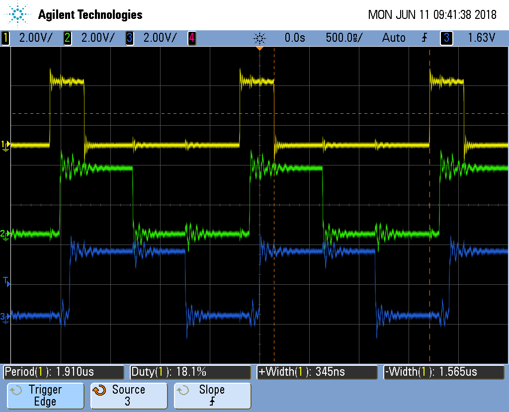

From the 'scope you see a 1 cycle on time results in a 450ns wide pulse and
a 3.06us period is .326KHz  Much
slower than the 10ns pusle we saw before.  But it may be more than fast enough
for manny applicaions.  For example, most servos run at 50Hz.

But we can do better.

=== Loop Unrolling for Better Performance
==== Problem
The ARM controlled code runs too slowly.

==== Solution
Simple loops unrolling can greatly improve the speed.  `pwm5.c` is our unrolled
version.

.pwm5.c Unrolled
[source,c,linenums]
----
include::code/pwm5.c[pwm5.c]
----

The output of `pwm5.c` is in the figure below.

.pwm5.c Unrolled version of pwm4.c
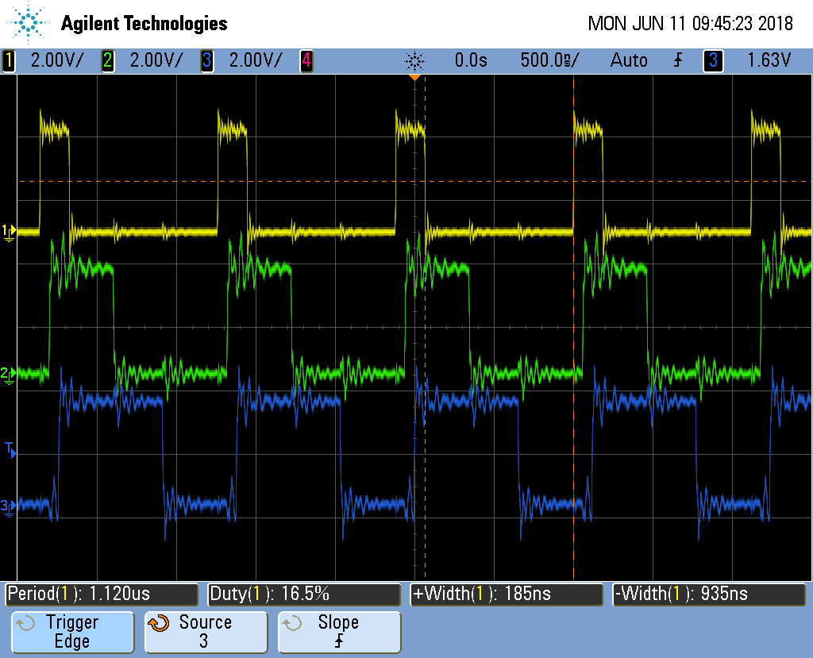

It's running about 6 times faster than `pwm4.c`.

.pwm4.c vs. pwm5.c
|===
|Measure|pwm4.c time|pwm5.c time|Speedup|pwm5.c w/o UNROLL|Speedup

|Period|3.06&mu;s   |510ns      |6x     |1.81&mu;s      |~1.7x
|Width+|450ns       |70ns       |~6x    |1.56&mu;s      |~.3x
|===

Not a bad speed up for just a couple of simple changes.

==== Discussion
Here's how it works.
First look at line 39.  You see `#pragma UNROLL(MAXCH)` which is a `pragma`
that tells the compiler to unroll the loop that follows.  We are unrolling it
`MAXCH` times (four times in this example). Just removing the `pragma` causes
the speedup compared to the `pwm4.c` case to drop from 6x to only 1.7x.  

We also have our `for` loop inside the `while` loop that can be unrolled.
Unfortunately `UNROLL()` doesn't work on it, therefore we have to do it by
hand. We could take the loop and just copy it three times, but that would
make it harder to maintain the code.  Instead I convered the loop into a 
`#define` (lines 14-24) and invoked `update()` as needed (lines 48-51).
This is not a function call. Whenever the preprocessor sees the `update()` 
it copies the code an then it's compiled.

This unrolling gets us an impressive 6x speedup.

=== Making All the Pulses Start at the Same Time
==== Problem
I have a mutlichannel PWM working, but the pulses aren't synchronized, that is
they don't all start at the same time.

==== Solution
The figure below is a zoomed in version of the previous figure. Notice the pulse in each channel starts about 15ns later than the channel above 
it.

.pwm5 Zoomed In 
image:figures/pwm5 zoomed.png[pwm5 zoomed.png]

The solution is to declare `Rtmp` (line 35) which holds the value for `__R30`.

.pwm6.c Sync'ed Version of pwm5.c 
[source,c,linenums]
----
include::code/pwm6.c[pwm6.c Sync'ed Version of pwm5.c]
----

Each channel writes it's value to `Rtmp` (lines 17 and 20) and then after
each channel has updated, `Rtmp` is copied to `__R30` (line 54).

==== Discussion
The following figure shows the channel are sync'ed. Though the period is slightly
longer than before.

.pwm6 Synchronized Channels
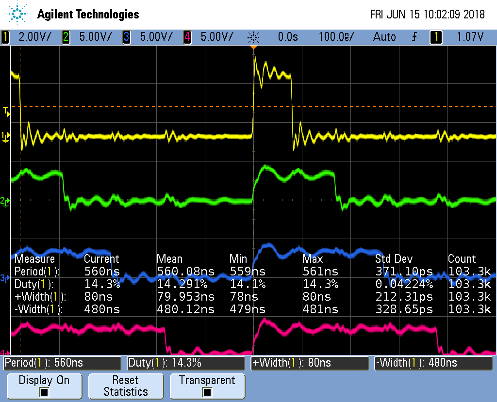

=== Adding More Channels via PRU 1
==== Problem
You need more output channels, or you need to shorten the period.

==== Solution
PRU 0 can output up to eight output pins (see 
<<#bit_positions,Mapping bit position to pin names>>). The code presented so far
can be easily extended to use the eight output pins.

But what if you need more channels?
You can always use PRU1, it has 14 output pins.

Or, what if four channels is enough, but you need a shorter period. Everytime
you add a channel, the overall period gets longer.  Twice as many channels 
means twice as long a period.  If you move half the channels to PRU 1, you
will make the period half as long.

Here's the code (`pwm7.c`)

.pwm7.c Using Both PRUs
[source,c,linenums]
----
include::code/pwm7.c[pwm7.c Using Both PRUs]
----

Be sure to run `pwm7_setup.sh` to get the coffect pins configured.
.pwm7_setup.sh
----
include::code/pwm7_setup.sh[pw7_setup.sh]
----
This makes sure the PRU 1 pins are properly configured.

Then compile and run with
[source,bash]
[subs=+quotes]
----
bone$ *make PRUN=0; make PRUN=1*
-    Stopping PRU 0
stop
CC	pwm7.c
LD	/tmp/pru0-gen/pwm7.obj
-	copying firmware file /tmp/pru0-gen/pwm7.out to /lib/firmware/am335x-pru0-fw
-    Starting PRU 0
start
-    Stopping PRU 1
stop
CC	pwm7.c
LD	/tmp/pru1-gen/pwm7.obj
-	copying firmware file /tmp/pru1-gen/pwm7.out to /lib/firmware/am335x-pru1-fw
-    Starting PRU 1
start
----
This will first stop, compile and start PRU 0, then do the same for PRU 1.

Moving half of the channels to PRU1 dropped the period from 510ns to 370ns, so
we gained a bit.

==== Discussion
There weren't many changes to be made.  Line 13 we set MAXCH to 2. Lines 43-46
is where the big change is.
[source,c]
----
		pru0_dram[2*ch  ] = on [ch+PRUN*MAXCH];	// Copy to DRAM0 so the ARM can change it
		pru0_dram[2*ch+1] = off[ch+PRUN*MAXCH];	// Interleave the on and off values
		onCount[ch] = on [ch+PRUN*MAXCH];
		offCount[ch]= off[ch+PRUN*MAXCH];
----
The Makefile sets `PRUN` to be the number of the PRU we are compiling for.  If 
we are compiling for PRU 0, `on[ch+PRUN*MAXCH]` becomes `on[ch+0*2]` which is
`on[ch]` which is what we had before.  But now if we are on PRU 1 it becomes
`on[ch+1*2]` which is `on[ch+2]`.  That means we are picking up the second 
half of the `on` and `off` arrays.  The first half goes to PRU 0, the second to
PRU 1.  So the same code can be used for both PRUs, but we get slightly different 
behavior.

Running the code you will see the next figure.

.pwm7 Two PRUs running
image:figures/pwm7 two prus running.png[pwm7 Two PRUs running]

What's going on there, the first channels look fine, but the PRU 1 channels
are blurred.  To see what's happening, let's stop the oscilloscope.

.pwm7 Two PRUs stopped
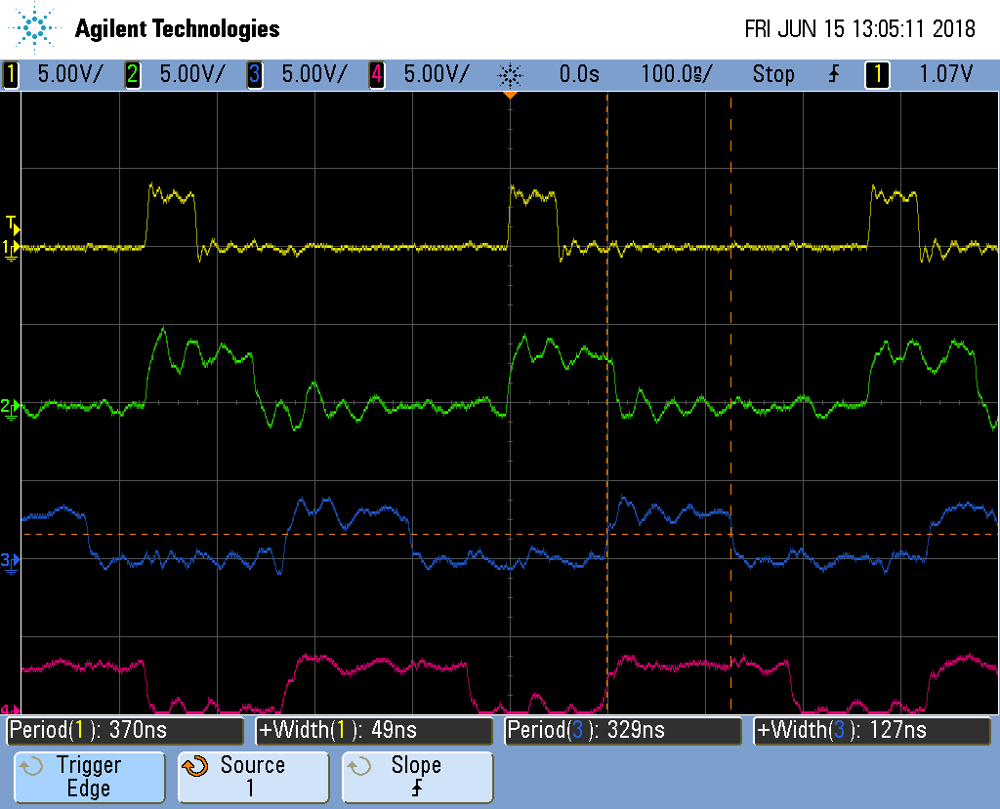

The stopped display shows that the four channels are doing what we wanted, except 
The PRU 0 channels have a period of 370ns while the PRU 1 channels at 330ns.
It appears the compiler has optimied the two PRUs slightly differenty.

=== Sychronziing Two PRUs
==== Problem
I need to synchronize the two PRUs so they run together.

==== Solution
Use the Interrupt Controller (INTC).  It allows one PRU to signal the other.
Page 225 of the 
https://www.ti.com/lit/ug/spruh73p/spruh73p.pdf[AM335x Technical Reference Manual]
has details of how it works.  Here's the code (`pwm8.c`).

.pwm8.c Using INTC to signal from one PRU to the other
[source,c,linenums]
----
include::code/pwm8.c[pwm8.c Using INTC to signal from one PRU to the other]
----

In `pwm8.c` PRU 1 waits for a signal from PRU 0, so be sure to start PRU 1 first.
`bone$ *make PRUN=1; make PRUN=0*

==== Discussion
The figure below shows the two PRUs are synchronized, though there is some extra
overhead in the process so the period is longer.

.pwm8 PRUs sycned
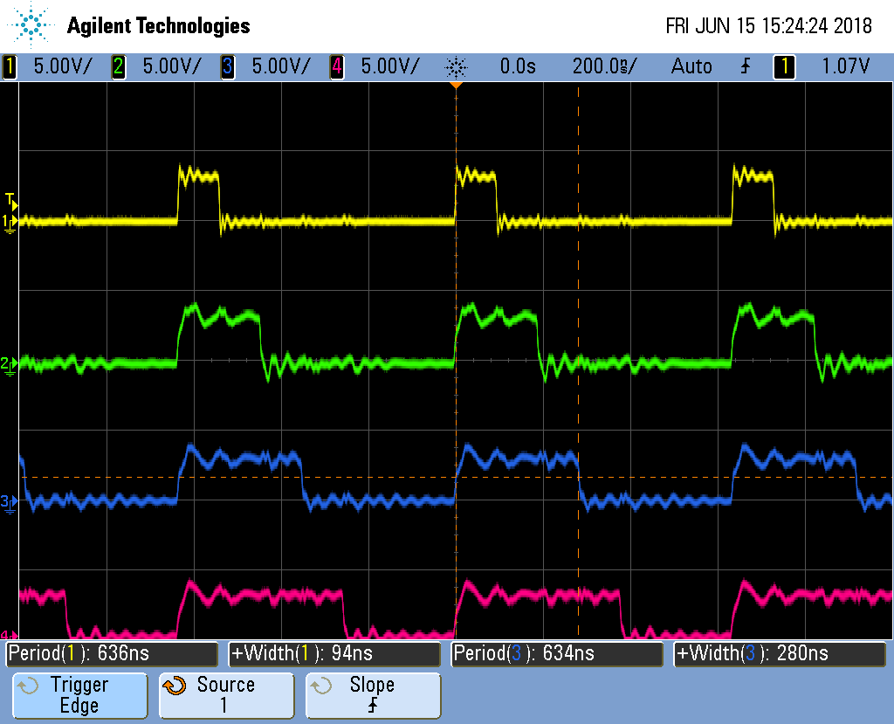

This isn't much different from the previous examples.
.pwm8.c changes from pwm7.c 
[cols="1,9"]
|===
|Line|Change

|32-45|For PRU 0 these define `configInitc()` which initializes the interupts.
See page 226 of the 
https://www.ti.com/lit/ug/spruh73p/spruh73p.pdf[AM335x Technical Reference Manual]
for a diagram explaining events, channels, hosts, etc.
|55-58|Set a configuration register and call `configInitc`.
|73-77|PRU 1 then waits for PRU 0 to signal it.  Bit 31 of `__R31` corresponds
to the Host-1 channel which `configInitc()` set up. We also clear event 16 so 
PRU 0 can set it again.
|81-84|On PRU 0 this generates the interupt to send to PRU 1.  I found PRU 1 was 
slow to respond to the interupt, so I put this code at the end of the loop to
give time for the signal to get to PRU 1.
|===

=== Reading an Input at Regular Intervals
==== Problem
You have an input pin that needs to be read at regular intervals.

==== Solution
You can use the `__R31` register to read an input pin. Let's use the following
pins.
[[blocks_io_pins]]
.Input/Output pins
|===
|Direction|Bit number|Black|Pocket
|out      |0         |P9_31|P1.36
|in       |7         |P9_25|P1.29
|===
These values came from <<blocks_mapping_bits>>.

Configure the pins with `input_setup.sh`.

.input_setup.sh
[source,bash,linenums]
----
include::code/input_setup.sh[]input_setup.sh]
----

The following code reads the input pin and writes its value to the output pin.
.input1.c
[source,c,linenums]
----
include::code/input1.c[input1.c]
----

==== Discussion

=== Analog Wave Generator
==== Problem
I want to generate an analog output, but only have GPIO pins.

==== Solution
The Beagle doesn't have a built in  analog to digital converter. You could
get a https://www.amazon.com/external-Adapter-Windows-Microphone-SD-CM-UAUD/dp/B001MSS6CS/0&keywords=audio+dongle[USB Audio Dongle] which are under $10.  But here
we'll take another approach.

Earlier we generated a PWM signal.  Here we'll generate a PWM whose duty cycle
changes with time.  A small duty cycle for when the output signal is small and
a large dudty cycle for when it is large.

This example was inspired by _A PRU Sin Wave Generator_ in chapter 13 of 
http://exploringbeaglebone.com/[Exploring BeagleBone by Derek Molloy].

Here's the code.

.sine1.c
[source,c,linenums]
[subs=+quotes]
----
include::code/sine1.c[since1.c]
----
Set the `#define` at line 7 to the number of samples in one cycle of the waveform 
and get the `#define` at line 8 to which waveform and then run `make`.

==== Discussion
The code has two parts.  The first part (lines 21 to 39) generate the waveform
to be output. The ``#define``s let you select which waveform you want to
generate.  Since the output is a percent duty cycle, the values in `waveform[]` 
must be between 0 and 100 inclusive. The waveform is only generated once, so
this part of the code isn't time critical.

The second part (lines 44 to 54) uses the generated data to set the
duty cycle of the PWM on a cycle-by-cycle basis. This part is time critical; 
the faster we can output the values, the higher the frequency of the output 
signal.

Suppose you want to generate a sawtooth waveform like the one shown in <<blocks_sawtooth>>.

[[blocks_sawtooth]]
.Continuous Sawtooth Waveform
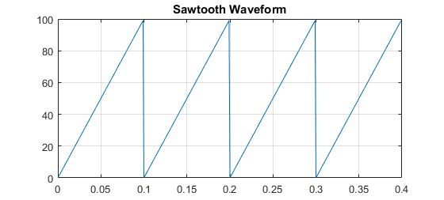

You need to sample the waveform and store one cycle. <<blocks_sawtoothsampled>>
shows a sampled version of the sawtooth. You need to generate `MAXT` samples; 
here we show 20 samples, which may be enough. In the code `MAXT` is set to 100.

[[blocks_sawtoothsampled]]
.Sampled Sawtooth Waveform
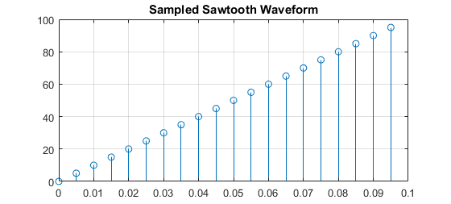

There's a lot going on here; let's take it line by line.

.Line-by-line of sine1.c
[cols="1,9"]
|===
|Line |Explanation

|2-5  |Standard c-header includes
|7    |Number for samples in one cycle of the analog waveform
|9    |Which waveform to use.  We've defined SAWTOOTH, TRIANGLE and SINE, but
you can define your own too.
|10-11|Declaring registers `_R30` and `_R31`.
|15-16|`onCount`	 how many cycles the PWM should be 1 and `offCount` counts
how many it should be off.
|18   |`waveform[]` stores the analog waveform being ouput.
|21-24|`SAWTOOTH` is the simplest of the waveforms. Each sample is the duty cycle 
at that time and must therefore be between 0 and 100. 
|26-31|`TRIANGLE` is also a simple waveform.  
|32-39|`SINE` generates a sine wave and also introduces floating point.  Yes, you can use floating point, but the PRUs don't have floating point hardware, 
rather, it's all done in software.  This mean using floating point will make
your code much bigger and slower.  Slower doesn't matter in this part, and 
bigger isn't bigger than our instruction memory, so we're OK.
|47   |Here the for loop looks up each value of the generated waveform.
|48,49|`onCount` is the number of cycles to be at 1 and `offCount` is the number 
of cycles to be 0. The two add to 100, one full cycle.
|50-52|Stay on for `onCount` cycles.
|53-55|No turn off for `offCount` cycles, the loop back and look up the next 
cycle count.
|===

<<blocks_sawunfiltered>> shows the output of the code. 

[[blocks_sawunfiltered]]
.Unfiltered Sawtooth Waveform
image:figures/sawunfiltered.png[Unfiltered Sawtooth Waveform]

It doesn't look like a sawtooth; but if you look at the left side you will 
see each cycle has a longer and longer on time.  The duty cycle is increasing.
Once it's almost 100% duty cycle, it switches to a very small duty cycle.
Therefore it's output what we programmed, but what we want is the average of 
the signal.  The left had side has a large (and increasing) average which 
would be for top of the sawtooth.  The right hand side has a small average,
which is what you want for the start of the sawtooth.

A simple low-pass filter, built with one resistor and one capacitor will do it.
<<blocks_filter>> shows how to wire it up.

[[blocks_filterwiring]]
.Low-Pass Filter Wiring Diagram
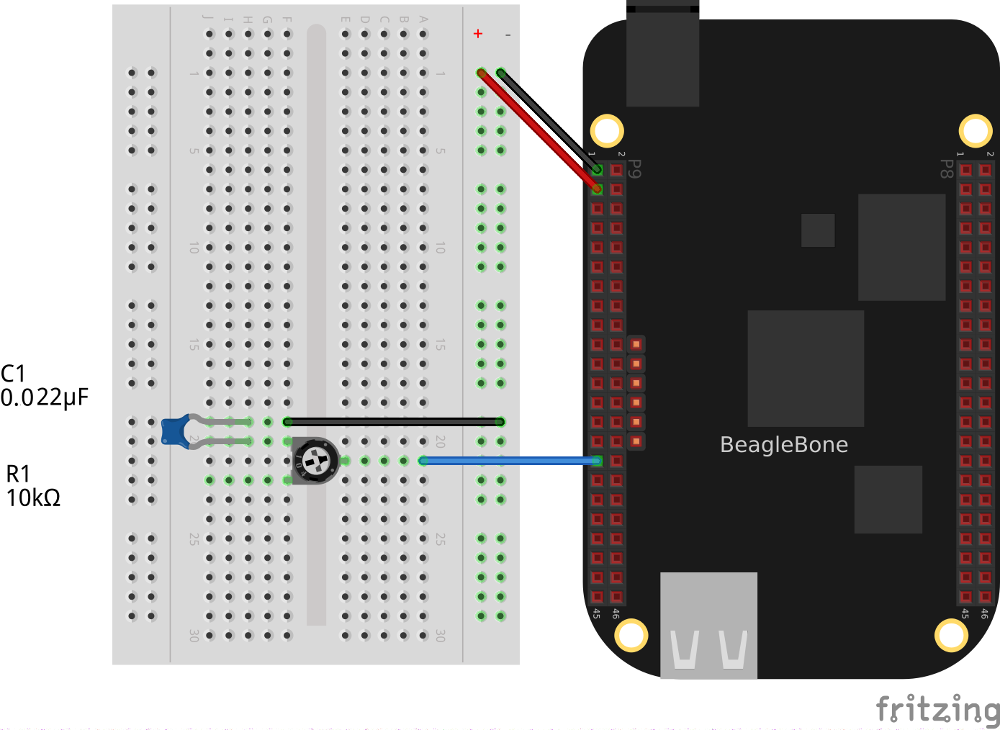

[NOTE]
====
I used a 10K&Omega; variable resistor and a 0.022&mu;F capacitor. (The figure
has the wrong value.) Probe the circuit between the resistor and the capacitor andI adjust the resistor until you get a good looking waveform.
====

<<blocks_sawscope>> shows the results for filtered the SAWTOOTH.

[[blocks_sawscope]]
.Reconstructed Sawtooth Waveform
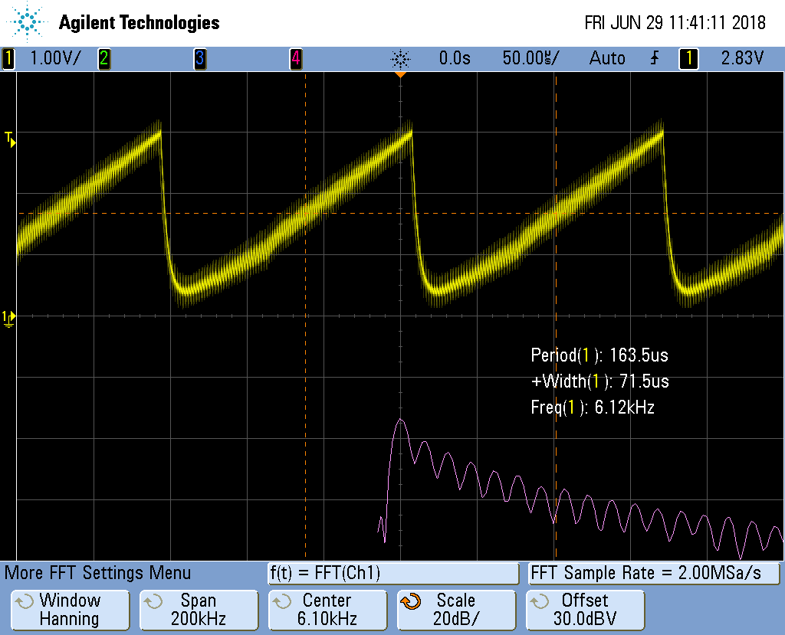

Now that look more like a sawtooth wave.  The top plot is the time-domain
plot of the output of the low-pass filter. The bottom plot is the FFT of the top 
plot, therefore it's the frequency domain. We are getting a sawtooth with a
frequency of about 6.1KHz. You can see the fundamental frequency on the 
bottom plot along with several harmonics.

The top looks like a sawtooth wave, 
but there is a high freqnecy superimposed on it.  We are only using a simple 
first-order filter.  You could lower the cutoff freqnecy by adjusting the
resistor.  You'll see something like <<blocks_lowercutoff>>.

[[blocks_lowercutoff]]
.Reconstructed Sawtooth Waveform with Lower Cutoff Frequency
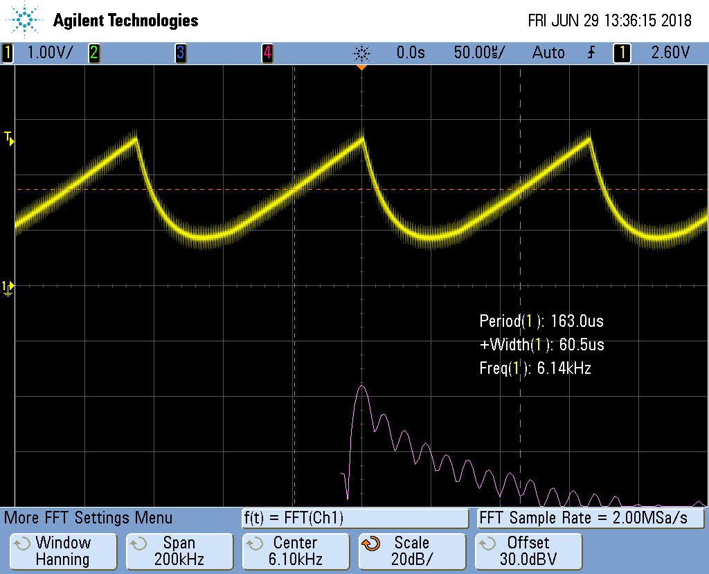

The high freqencies have been reduced, but the corner of the waveform has 
been rounded.  You can also adjust the cutoff to a higher frequency and you'll 
get a sharper corner, but you'll also get more high frequencies. See 
<<blocks_highercutoff>>

[[blocks_highercutoff]]
.Reconstructed Sawtooth Waveform with Higher Cutoff Frequency
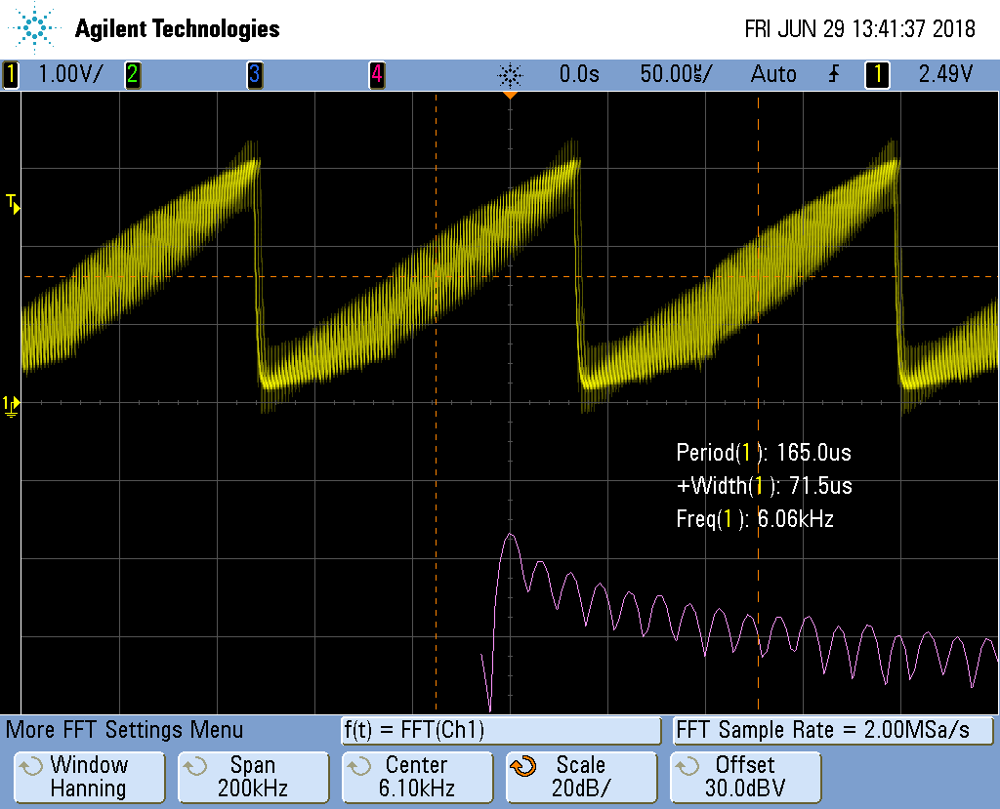

Adjust to taste, though the real solution is to build a higher order filter. 
Search for _second order filter_ and you'll find some nice circuits.

You can adjust the frequency of the signal by adjesting `MAXT`.  A smaller 
`MAXT` will give a higher frequency.  I'm gotten good results with `MAXT` 
as small as 20.

You can also get a triangle waveform by setting the `#define`. 
<<blocks_triangle>> shows the output signal.

[[blocks_triangle]]
.Reconstructed Triangle Waveform
image:figures/triangle.png[Reconstructed Triangle Waveform]

And also the sine wave as shown in <<blocks_sine>>.

[[blocks_sine]]
.Reconstructed Sinusoid Waveform
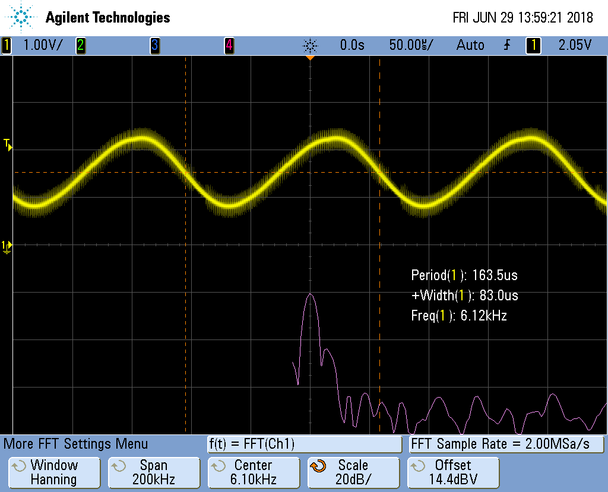

Notice on the bottom plot the harmonics are much more suppressed.

Generating the sine waveform uses ((floats)). This requires much more code.
You can look in `/tmp/pru0-gen/sine1.map` to see how much memory is being used.
<<blocks_sine1_map>> shows the first few lines for the sine wave.

[[blocks_sine1_map]]
./tmp/pru0-gen/sine1.map for Sine Wave
[source,bash,linenums]
----
include::code/sine1.map[lines=1..22]
----

Notice line 19 shows 0x18c0 bytes are being used for instructions.  That's 6336 
in decimal.

Now compile for the sawtooth and you see only 444 byes are used.  Floating-point 
requires over 5K more bytes.  Use with care.  If you are short on instruction
space, you can move the table generation to the ARM and just copy the table
to the PRU.

// ToDo === Ultrasonic Sensor Application

[[blocks_ws2812]]
=== WS2812 (NeoPixel) driver
==== Problem
((("displays", "NeoPixel LED strings")))
((("outputs", "NeoPixel LED strings")))
((("Adafruit Neopixel LED strings")))
((("Neopixel LED strings")))
((("LEDs", "Adafruit Neopixel LED strings")))
You have an http://www.adafruit.com/products/1138[Adafruit NeoPixel LED string]
or http://www.adafruit.com/products/1487[Adafruit NeoPixel LED matrix] 
and want to light it up.

==== Solution
NeoPixel is Adafruit's name for the WS2812 Intelligent control LED.  Each 
NeoPixel contains a Red, Green and Blue LED with a PWM controller that can
dim each one individually making a rainbow of colors possible.  The
NeoPixel is driven by a single serial line.  The timing on the line is very
sensesitive, which make the PRU a perfect candidate for driving it.

Wire the input to `P9_29` and power to 3.3V and ground to ground as shown in
<<blocks_neo_wiring>>.

[[blocks_neo_wiring]]
.NeoPixel Wiring
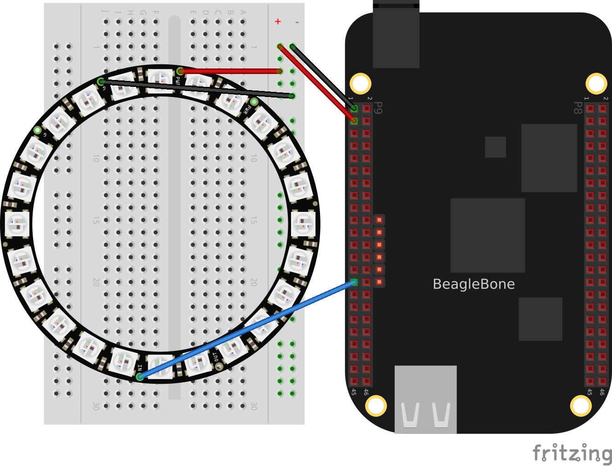

Test your wiring with the simple code in <<blocks_neo1>> 
which to turns all pixels white.

[[blocks_neo1]]
.neo1.c - Code to turn all NeoPixels's white
[source,c,linenums]
[subs=+quotes]
----
include::code/neo1.c[]
----

==== Discussion
<<blocks_sequence>> (taken from  https://cdn-shop.adafruit.com/datasheets/WS2812.pdf[WS2812 Data Sheet]) shows the following waveforms are used to send a bit of data.

[[blocks_sequence]]
.NeoPixel bit sequence
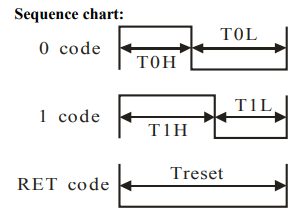

Where the times are:
|===
|Label|Time in ns

|T0H|350
|T0L|800
|T1H|700
|T1L|600
|Treset|>50,000
|===

The code in <<blocks_neo1>> define these times in lines 7-10.  
The `/5` is because 
each instruction take 5ns.  Lines 27-30 then set the output to 1 for
the desired time and then to 0 and keeps repeating it for the entire
string length.  <<blocks_zero_scope>> 
shows the waveform for sending a 0 value.  Note the times are spot on.

[[blocks_zero_scope]]
.NeoPixel zero timing
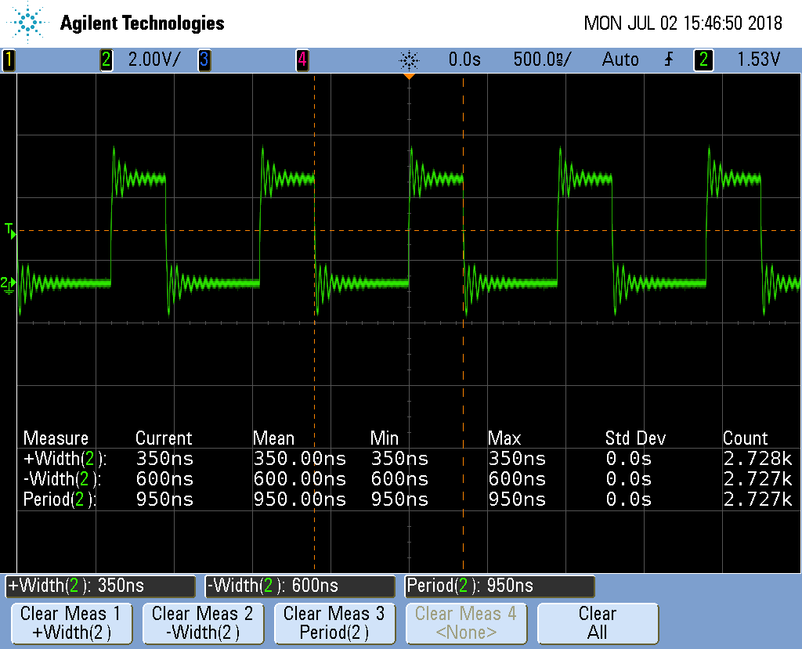

Each NeoPixel listens for a RGB value. Once a value has arrived all other values
that follow are passed on to the next NeoPixel which does the same thing.
That way you can individually control all of the NeoPixels.

Lines 38-40 send out a reset pulse.  If a NeoPixel sees a reset pulse it will
grab the next value for itself and start over again.

=== Setting NeoPixels to Different Colors
==== Problem
I want to set the LEDs to different colors.

==== Solution
Wire your NeoPixels as shown in <<blocks_neo_wiring>> then run the code in 
<<blocks_neo2>>.

[[blocks_neo2]]
.neo2.c - Code to turn on green, red, blue
[source,c,linenums]
[subs=+quotes]
----
include::code/neo2.c[]
----

This will make the first LED green, the second red and the third blue.

==== Discussion
<<blocks_new_data_seq>> shows the sequence of bits used to control the
green, red and blue values.

[[blocks_new_data_seq]]
.NeoPixel data sequence
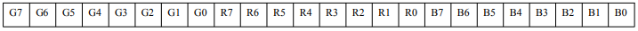
[NOTE]
====
The usual order for colors is RGB (red, green, blue), but the NeoPixels use
GRB (green, red, blue).
====

<<blocks_neo2_line>> is the line-by-line for `neo2.c`.
[[blocks_neo2_line]]
[cols="1,9"]
|====
|Line |Explanation

|22   |Define the string of colors to be output.  Here the ordering of the
bits is the same as <<blocks_new_data_seq>>, GRB. 
|25   |Loop for each color to output.
|26   |Loop for each bit in an GRB color.
|27   |Get the j^th^ color and mask off all but the j^th^ bit.  `(0x1<<i)` takes
the value `0x1` and shifts it left `i` bits.  When anded (&) with `color[j]` 
it will zero out all but the i^th^ bit.  If the result of the operation is
1, the `if` is done, otherwise the `else` is done.
|28-31|Send a 1.
|33-36|Send a 0.
|40-32|Send a reset pulse once all the colors have been sent.
|====

[NOTE]
====
This will only change the first `STR_LEN` LEDs.  The LEDs that follow will not
be changed.
====

=== Controlling Arbitrary LEDs
==== Problem
I want to change the 10^th^ LED and not have to change the others.

==== Solution
You need to keep an array of colors for the whole string in the PRU.  Change
the color of any pixels you want in the array and then send out the whole
string to the LEDs.  <<blocks_neo3>> shows an example animates a red pixel
running around a ring of blue background.  <<blocks_neo3_video>> shows
the code in action.

[[blocks_neo3_video]]
.neo3.c - Simple animation
video::figures/ring_around.mp4[width=320, end=4]

[[blocks_neo3]]
.neo3.c - Code to animate a red pixel running around a ring of blue
[source,c,linenums]
[subs=+quotes]
----
include::code/neo3.c[]
----

==== Discussion
Here's the highlights.

[cols="1,9"]
|===
|Line|Explanation

|31,32|Initiallize the array of colors.
|37-40|Update the array.
|43-57|Send the array to the LEDs.
|58-60|Send a reset.
|62,63|Wait a bit.
|===

=== Controlling NeoPixels Through a Kernel Driver
==== Problem
You want to control your NeoPixels through a kernel driver so you can control it 
through a `/dev` interface.

==== Solution
The https://github.com/beagleboard/linux/raw/4.9/drivers/rpmsg/rpmsg_pru.c[rpmsg_pru] 
driver provides a way to pass data between the ARM processor and
the PRUs.  It's already included on current images. <<blocks_neo4>> shows
an example.

[[blocks_neo4]]
.neo4.c - Code to talk to the PRU via rpmsg_pru
[source,c,linenums]
[subs=+quotes]
----
include::code/neo4.c[]
----

Run the code as usual.
[source,c]
[subs=+quotes]
----
bone$ *export TARGET=neo4*
bone$ *make*
-    Stopping PRU 0
stop
CC	neo4.c
LD	/tmp/pru0-gen/neo4.obj
-	copying firmware file /tmp/pru0-gen/neo4.out to /lib/firmware/am335x-pru0-fw
-    Starting PRU 0
start
bone$ *sudo chmod 666 /dev/rpmsg_pru30*
bone$ *echo 0 0xff 0 127 > /dev/rpmsg_pru30*
bone$ *echo -1 > /dev/rpmsg_pru30*
----

`/dev/rpmsg_pru30` is a device driver that lets the ARM talk to the PRU.
The first `echo` says to set the 0^th^ LED to RGB value 0xff 0 127. (Note: you can
mix hex and decimal.) The second `echo` tells the driver to send the data to the
LEDs.  You 0^th^ LED should now be lit.

==== Discussion
There's a lot here.  I'll just hit some of the highlights in <<blocks_neo4_lines>>.

[[blocks_neo4_lines]]
.Line-by-line for neo4.c
[cols="1,9"]
|====
|Line |Explanation

|29   |The `CHAN_NAME` of `rpmsg-pru` matches that `prmsg_pru` driver that is
is already installed.  This connects this PRU to the driver.
|31   |The `CHAN_PORT` tells it to use port 30.  That's why we use
`/dev/rpmsg_pru30`
|39-45|Same as the previous NeoPixel examples.
|49   |`payload[]` is the buffer that receives the data from the ARM.
|50   |`color[]` is the state to be sent to the LEDs.
|63-66|`color[]` is initialized.
|68-82|Where are a number of details needed to set up the channel between 
the PRU and the ARM.
|85   |Here we wait until the ARM sends us some numbers.
|89   |Receive all the data from the ARM, store it in `payload[]`.
|93-101|The data sent is:  index red green blue.  Pull off the index.  If it's 
in the right range, pull off the red, green and blue values.
|103  |The NeoPixels want the data in GRB order.  Shift and or everything 
together.
|106-130|If the `index` = 1, send the contents of `color` to the LEDs.  This
code is same as before.
|====

You can now use programs running on the ARM to send colors to the PRU.
<<blocks_neo-rainbow>> shows an example.
[[blocks_neo-rainbow]]
.neo-rainbow.py - A python program using /dev/rpmsg_pru30
[source,python,linenums]
[subs=+quotes]
----
include::code/neo-rainbow.py[]
----
Line 19 writes the data to the PRU.  Be sure to have a newline, or space after
the last number, or you numbers will get blurred together.

=== RGB LED Matrix - No Integrated Drivers
==== Problem
You have a RGB LED matrix (<<case_rgb_matrix..) and want to know
at a low level how the PRU works.

==== Solution
The best description I've found for the RGB Matrix is from 
https://www.adafruit.com/[Adafruit].  I've reproduced it here, with 
adjustments for the 64x32 matrix we are using.

[verse, https://cdn-learn.adafruit.com/downloads/pdf/32x16-32x32-rgb-led-matrix.pdf]
____
There's zero documention out there on how these matrices work, and no public datasheets or spec sheets so we are going to try to document how they work.

First thing to notice is that there are 2048 RGB LEDs in a 32x64 matrix. Like pretty much every matrix out there, you can't drive all 2048 at once. One reason is that would require a lot of current, another reason is that it would be really expensive to have so many pins. Instead, the matrix is divided into 16 interleaved sections/strips. The first section is the 1^st^ 'line' and the 17^th^ 'line' (64 x 2 RGB LEDs = 128 RGB LEDs), the second is the 2^nd^ and 18^th^ line, etc until the last section which is the 16^th^ and 32^nd^ line. You might be asking, why are the lines paired this way? wouldnt it be nicer to have the first section be the 1^st^ and 2^nd^ line, then 3^rd^ and 4^th^, until the 15^th^ and 16^th^? The reason they do it this way is so that the lines are interleaved and look better when refreshed, otherwise we'd see the stripes more clearly.

So, on the PCB is 24 LED driver chips. These are like 74HC595s but they have 16 outputs and they are constant current. 16 outputs * 24 chips = 384 LEDs that can be controlled at once, and 128 * 3 (R G and B) = 384. So now the design comes together: You have 384 outputs that can control one line at a time, with each of 384 R, G and B LEDs either on or off. The controller (say an FPGA or microcontroller) selects which section to currently draw (using A, B, C and D address pins - 4 bits can have 16 values). Once the address is set, the controller clocks out 384 bits of data (48 bytes) and latches it. Then it increments the address and clocks out another 384 bits, etc until it gets to address #15, then it sets the address back to #0
____

The connector looks like <<blocks_matrix_j1>>.

[[blocks_matrix_j1]]
.RGB Matrix J1 connector
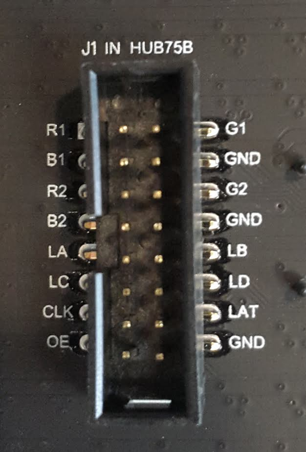

==== Discussion

[[blocks_pocket_scroller_pins]]
.PocketScroller pin table
|====
|J1 Connector Pin|Pocket Headers|gpio port and bit number|Linux gpio number|PRU R30 bit number

|R1 |P2_10|1-20|52 |
|B1 |P2_06|1-25|57 |
|R2 |P2_04|1-26|58 |
|B2 |P2_01|1-18|50 |
|LA |P2_32|3-16|112|PRU0.2
|LC |P1_31|3-18|114|PRU0.4
|CLK|P1_33|3-15|111|PRU0.1 (not used)
|OE |P1_29|3-21|117|PRU0.7
|G1 |P2_08|1-28|60 |
|G2 |P2_02|1-27|59 |
|LB |P2_30|3-17|113|PRU0.3
|LD |P2_34|3-19|115|PRU0.5
|LAT|P1_36|3-14|110|PRU0.0
|====

The J1 to gpio port and bit number comes from
<https://github.com/FalconChristmas/fpp/blob/master/src/pru/PocketScrollerV1.hp>.

The gpio port and bit number mapping to Pocket Headers comes from 
<https://docs.google.com/spreadsheets/d/1FRGvYOyW1RiNSEVprvstfJAVeapnASgDXHtxeDOjgqw/edit#gid=0>.

=== Compiling and Inserting rpmsg_pru
==== Problem
Your Beagle doesn't have rpmsg_pru.

==== Solution
Do the following.
[source,bash]
[subs=+quotes]
----
bone$ *cd 05blocks/code/module*
bone$ *sudo apt install linux-headers-\`uname -r`*
bone$ *wget https://github.com/beagleboard/linux/raw/4.9/drivers/rpmsg/rpmsg_pru.c*
bone$ *make*
make -C /lib/modules/4.9.88-ti-r111/build M=$PWD
make[1]: Entering directory '/usr/src/linux-headers-4.9.88-ti-r111'
  LD      /home/debian/PRUCookbook/docs/05blocks/code/module/built-in.o
  CC [M]  /home/debian/PRUCookbook/docs/05blocks/code/module/rpmsg_client_sample.o
  CC [M]  /home/debian/PRUCookbook/docs/05blocks/code/module/rpmsg_pru.o
  Building modules, stage 2.
  MODPOST 2 modules
  CC      /home/debian/PRUCookbook/docs/05blocks/code/module/rpmsg_client_sample.mod.o
  LD [M]  /home/debian/PRUCookbook/docs/05blocks/code/module/rpmsg_client_sample.ko
  CC      /home/debian/PRUCookbook/docs/05blocks/code/module/rpmsg_pru.mod.o
  LD [M]  /home/debian/PRUCookbook/docs/05blocks/code/module/rpmsg_pru.ko
make[1]: Leaving directory '/usr/src/linux-headers-4.9.88-ti-r111'
bone$ *insmod rpmsg_pru.ko*
bone$ *lsmod | grep rpm*
rpmsg_pru               5799  2
virtio_rpmsg_bus       13620  0
rpmsg_core              8537  2 rpmsg_pru,virtio_rpmsg_bus
----
It's now installed and ready to go.

=== Copyright
[source,c,linenums]
.copyright.c
----
include::code/copyright.c[copyright.c]
----