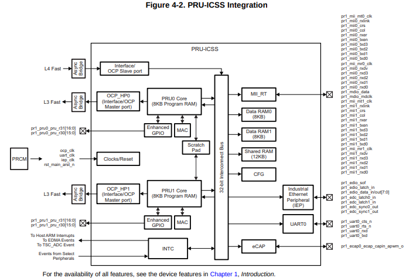
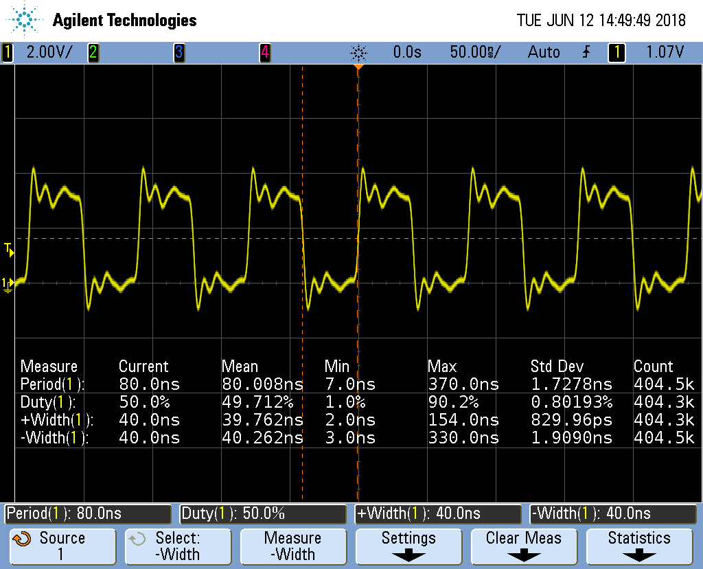
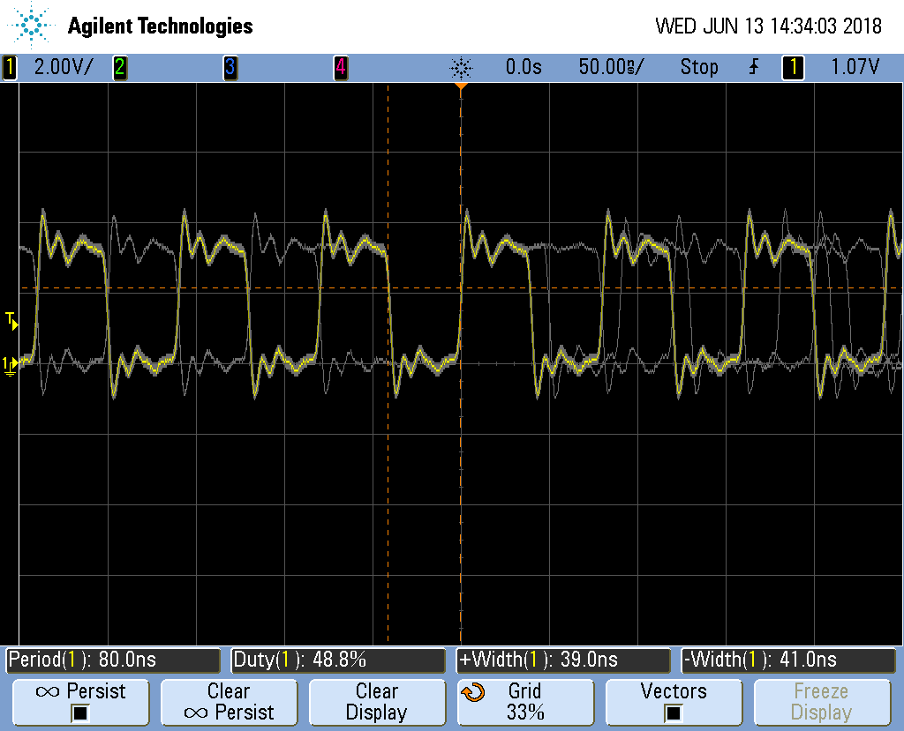

include::../header.adoc[]

== Accessing More I/O
So far the examples have shown how to access the GPIO pins on the BeagleBone Black's 
`P9` header and through the `pass:[__]R30` register.  Below shows how more GPIO pins
can be accessed.

The following are resources used in this chapter.

.Resources
* https://github.com/derekmolloy/exploringBB/blob/master/chp06/docs/BeagleboneBlackP8HeaderTable.pdf[P8 Header Table]
* https://github.com/derekmolloy/exploringBB/blob/master/chp06/docs/BeagleboneBlackP9HeaderTable.pdf[P9 Header Table]
* http://www.ti.com/lit/pdf/spruhz6l[AM572x Technical Reference Manual] (AI)
* http://www.ti.com/lit/pdf/spruh73[AM335x Technical Reference Manual] (All others)
* http://www.ti.com/lit/ug/spruhv6a/spruhv6a.pdf[PRU Assembly Language Tools]

=== Editing /boot/uEnv.txt to Access the P8 Header on the Black
==== Problem
When I try to configure some pins on the `P8` header of the Black I get an error.

.config-pin
[source,bash]
[subs=+quotes]
----
bone$ *config-pin P8_28 pruout*
P8_27 pinmux file not found!
Pin has no cape: P8_27
----
// TODO:  I made up the output.  Make sure it is correct.

==== Solution
On the images for the BeagleBone Black, the HDMI display driver is enabled by
default and uses many of the `P8` pins.  If you are not using
HDMI video (or the HDI audio, or even the eMMC) you can disable it by editing
`/boot/uEnv.txt`

Open `/boot/uEnv.txt` and scroll down aways until you see:

./boot/uEnv.txt
[source,bash]
----
###Disable auto loading of virtual capes (emmc/video/wireless/adc)
#disable_uboot_overlay_emmc=1
disable_uboot_overlay_video=1
#disable_uboot_overlay_audio=1
----
Uncomment the lines that correspond to the devices you want to disable and
free up their pins.  
[TIP]
====
https://github.com/derekmolloy/exploringBB/blob/master/chp06/docs/BeagleboneBlackP8HeaderTable.pdf[P8 Header Table]
shows what pins are allocated for what.
====
Save the file and reboot.  You now have access to the `P8` pins.

=== Accessing gpio

==== Problem
I've used up all the GPIO in `pass:[__]R30`, where can I get more?

==== Solution
So far we have focused on using PRU 0.  
<<../05blocks/blocks.html#blocks_mapping_bits,Mapping bit positions to pin names
PRU>> shows 
// TODO Put a tag on Table 3
that PRU 0 can access ten GPIO pins on the BeagleBone Black.  If you use
PRU 1 you can get to an additional 14 pins (if they aren't in use for other things.)

What if you need even more GPIO pins? You can access _any_ GPIO pin by going
through the **o**ne **c**hip **p**eripheral (OCP) port.

.PRU Integration

The figure above shows we've been using the _Enhanced GPIO_ interface when using
`pass:[__]R30`, but it also shows you can use the OCP.  You get access to many more
GPIO pins, but it's a slower access.

.gpio.pru0.c
[source,c,linenums]
----
include::code/gpio.pru0.c[gpio.pru0.c]
----
This code will toggle `P9_11` on and off. Here's the setup file.

.setup.sh
[source,bash,linenums]
----
include::code/setup.sh[setup.sh]
----
Notice in the code `config-pin` set `P9_11` to `gpio`, not `pruout`. This is because
are are using the OCP interface to the pin, not the usual PRU interface.

Set your exports and make.
[source,bash] 
[subs=+quotes]
----
bone$ *source setup.sh*
TARGET=gpio.pru0
...
bone$ *make*
/var/lib/cloud9/common/Makefile:29: MODEL=TI_AM335x_BeagleBone_Black,TARGET=gpio.pru0
-    Stopping PRU 0
-	copying firmware file /tmp/cloud9-examples/gpio.pru0.out to /lib/firmware/am335x-pru0-fw
write_init_pins.sh
-    Starting PRU 0
MODEL   = TI_AM335x_BeagleBone_Black
PROC    = pru
PRUN    = 0
PRU_DIR = /sys/class/remoteproc/remoteproc1
----

==== Discussion
When you run the code you see `P9_11` toggling on and off.  Let's go through
the code line-by-line to see what's happening.

.gpio.pru0.c line-by-line
[cols="1,9"]
|===
|Line|Explanation

|2-5 |Standard includes
|5   |The AM335x has four 32-bit GPIO ports.  Lines 55-58 of `prugpio.h` define the addresses
for each of the ports.  You can find these in Table 2-2 page 180 of the
https://www.ti.com/lit/ug/spruh73p/spruh73p.pdf[AM335x Technical Reference Manual].
Look up `P9_11` in the https://github.com/derekmolloy/exploringBB/blob/master/chp06/docs/BeagleboneBlackP9HeaderTable.pdf[P9 Header Table].
Under the _Mode7_ column you see `gpio0[30]`.  This means `P9_11` is bit 30
on GPIO port 0.  Therefore we will use `GPIO0` in this code. 

You can also run 
`gpioinfo` and look for P9_11.
|5    |Line 103 of `prugpio.h` defines the address offset from `GIO0` that will 
allow us to _clear_
any (or all) bits in GPIO port 0. Other architectures require you to read a port,
then change some bit, then write it out again, three steps.  Here we can do the same by writing to one location, just one step.
|5    |Line 104 of `prugpio.h` is like above, but for _setting_ bits.
|5    |Using this offset  of line 105 of `prugpio.h` lets us just read the bits
without changing them.
|7    |This shifts `0x1` to the 30^th^ bit position, which is the one corresponding
to `P9_11`.
|14   |Here we initialize `gpio0` to point to the start of GPIO port 0's control
registers.
|17   |`gpio0[GPIO_SETDATAOUT]` refers to the `SETDATAOUT` register of port 0.
Writing to this register turns on the bits where 1's are written,
but leaves alone the bits where 0's are.
|18   |Wait 100,000,000 cycles, which is 0.5 seconds.
|19   |This is line 17, but the output bit is set to 0 where 1's are written.
|===

===== How fast can it go?
This approach to GPIO goes through the slower OCP interface.  If you set `pass:[__]delay_cycles(0)` you can see how fast it is.

.gpio.pru0.c with pass:[__]delay_cycles(0)
delay_cycles(0)]

The period is 80ns which is 12.MHz.  That's about one forth the speed of the
`pass:[__]R30` method, but still not bad.

If you are using an oscilloscope, look closely and you'll see the following.

.PWM with jitter

The PRU is still as solid as before in it's timing, but now it's going through
the OCP interface.  This interface is shared with other parts of the system,
therefore the sometimes the PRU must wait for the other parts to finish.  
When this happens the pulse width is a bit longer than usual thus adding
jitter to the output.

For many applications a few nanoseconds of jitter is unimportant and this
GPIO interface can be used.  If your application needs better timing,
use the `pass:[__]R30` interface.
 

[[io_uio]]
=== Configuring for UIO Instead of RemoteProc
==== Problem
You have some legacy PRU code that uses UIO instead of remoteproc and
you want to switch to UIO.

==== Solution
Edit `/boot/uEnt.txt` and search for `uio`.  I find

----
###pru_uio (4.4.x-ti, 4.9.x-ti, 4.14.x-ti & mainline/bone kernel)
uboot_overlay_pru=/lib/firmware/AM335X-PRU-UIO-00A0.dtbo
----
Uncomment the `uboot` line.  Look for other lines with
`uboot_overlay_pru=` and be sure they are commented out.

Reboot your Bone.

[subs=+quotes]
----
bone$ *sudo reboot*
----

Check that UIO is running.

[subs=+quotes]
----
bone$ *lsmod | grep uio*
uio_pruss              16384  0
uio_pdrv_genirq        16384  0
uio                    20480  2 uio_pruss,uio_pdrv_genirq
----
You are now ready to run the legacy PRU code.

// ==== Discussion

// ToDo, is there anything to discuss?

=== Converting pasm Assembly Code to clpru
==== Problem
You have some legacy assembly code written in pasm and it won't assemble 
with clpru.

==== Solution
Generally there is a simple mapping from pasm to clpru. 
http://processors.wiki.ti.com/index.php/PRU_Assembly_Instructions#pasm_vs._clpru[pasm vs. clpru]
notes what needs to be changed. I have a less complete version on my
https://elinux.org/EBC_Exercise_30_PRU_porting_pasm_to_clpru[eLinux.org site].

==== Discussion
The clpru assembly can be found in http://www.ti.com/lit/ug/spruhv6a/spruhv6a.pdf[PRU Assembly Language Tools].

// ToDo === ECAP/PWM?
